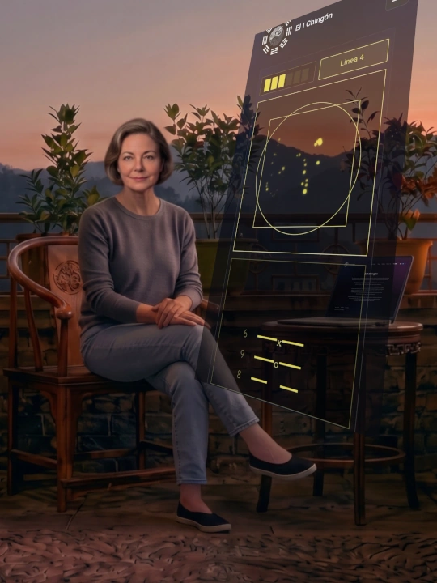

Mi proyecto El I Chingón es el matrimonio de dos mundos antípodas el uno del otro: un oráculo cuyos orígenes se pierden en la bruma de los tiempos y el mundo digital moderno, con la Inteligencia Artificial automatizando todo a su paso. El fruto de ese matrimonio es una app de consulta que pretende poner la sabiduría milenaria del I Ching al alcance de todos.

Pero con toda honestidad, quiero plantearles un dilema que siempre he tenido en mente durante el proceso de desarrollo de esta app: Si aíslo los elementos esenciales del I Ching, ¿podriamos prescindir de un ritual de consulta? O por el contrario, es el I Ching algo "espiritual" que jamás podrá ser codificado en un algoritmo, sino que requiere de un "ritual mágico"? 

La respuesta a esto no es - como decía un famoso político de mi país - ni lo uno ni lo otro sino todo lo contrario.

Y la respuesta a esa pregunta pasa necesariamente por abordar esta otra:

¿Qué hace que una consulta al I Ching sea verdaderamente significativa y válida? 

En nuestra era digital, es fácil suponer que la eficacia de un oráculo moderno como pretende ser mi app recae en la precisión de su código o en la sofisticación de su algoritmo (es decir, en las decisiones que yo tome como desarrolladora del app). Sin embargo, como vamos a ver en este artículo, la claridad de las respuestas de este oráculo digital no depende únicamente de cuán bueno sea mi software, sino del estado interno del consultante en el momento preciso de formular la pregunta.

Esta reflexión es el fruto de unir los mensajes de dos consultas realizadas al I Ching en momentos distintos: una sobre la disposición mental requerida para acercarse al oráculo, que nos arrojó el Hexagrama 33 (La Retirada), y otra más reciente sobre los requisitos técnicos de nuestra aplicación, que nos respondió con el Hexagrama 25 (La Inocencia). Ambas respuestas, aparentemente distantes, convergen en una misma verdad.

---

## El primer paso: Acallar el ruido (La Retirada)

El proceso comienza mucho antes de lanzar las monedas o trazar sobre una pantalla. Comienza con una pregunta. Y continúa con una reflexión sobre esa pregunta: ¿para qué quiero saber esto realmente? ¿cuáles son los supuestos detrás de mi pregunta?

La preparación ritual requiere, en primer lugar, formular nuestra pregunta de forma clara, evitando cuestionamientos dicotómicos (de tipo sí/no) para invitar a una respuesta descriptiva que refleje la interacción holística del Yin y el Yang. Y como el I Ching es más que todo una herramienta de auto-conocimiento, conviene aclararnos a nosotros mismos cuáles son las actitudes, emociones y sensaciones que traemos con nosotros o que suponemos llevan los demás en el contexto de la pregunta.

Conviene, y esto es importante señalar, escribir la pregunta. No solo porque cuando escribes aclaras más tus pensamientos, sino porque al momento de interpretar el oráculo, la pregunta nos da un marco imprescindible para su interpretación, bien sea si acudes a un intérprete del I Ching - humano o IA - o si interpretas la respuesta tú mismo. 

Pero tener la pregunta no es todo. Hay después de todo, un ritual de preparación. En una oportunidad, yo le pregunté esto al I Ching:

> ¿Qué, según el I Ching mismo, debería de tener en cuenta alguien que consulta al I Ching buscando sabiduría o para obtener una perspectiva profunda sobre alguna encrucijada o situación compleja?

Y el I Ching me respondió con el [Hexagrama 33]({}), *La Retirada*, con líneas móviles 4, 5 y 6,  cuya imagen presenta el cielo por encima de la montaña. El consultante debe ser como esa montaña, permaneciendo firme y en sublime quietud, sin pretender acceder al conocimiento espiritual por la fuerza.

Pero, ¿de qué debemos retirarnos? No se trata de una retirada física, sino de alejarnos de los aspectos inferiores de nosotros mismos: la charla mental incesante, las preconcepciones del ego, el sentido de urgencia y la búsqueda de resultados inmediatos o mágicos. Crear este espacio de silencio interno es el requisito fundamental para que el oráculo nos hable con claridad.

---

## La cumbre interior: El ascenso hacia la Modestia

La imagen de la montaña bajo el cielo resuena profundamente en el espíritu humano como un arquetipo universal. Desde el Sinaí y el Gólgota en la tradición judeocristiana, pasando por el Olimpo griego y el Monte Kailash en la India, hasta las brumosas montañas de Penglai en China, las cumbres siempre han representado el umbral donde la tierra y el cielo se encuentran.

Esta simbología es magistralmente capturada en la novela *El Monte Análogo* del poeta surrealista René Daumal, donde se describe una montaña cuya base es accesible a cualquiera - como la vida cotidiana -, pero cuya cumbre es invisible a menos que el buscador esté en la frecuencia espiritual correcta. El I Ching funciona exactamente igual: su base (el texto y el método) está ahí para todos, pero su verdadera sabiduría solo se revela a quien adopta la actitud correcta al iniciar el ascenso.

Las líneas móviles (4, 5 y 6) del [Hexagrama 33]({}) nos muestran los peldaños de este ascenso, indicando que la consulta debe ser una decisión voluntaria donde se suelta la carga innecesaria, manteniendo una actitud serena que culmina en la liberación de la necesidad de controlar el resultado, un estado donde "todo es favorable". Este proceso transforma el Hexagrama 33 en el Hexagrama 15, *La Modestia*, revelando que el éxito de la retirada conduce a un estado de ecuanimidad y equilibrio. Al igual que enseñan otras tradiciones sagradas, la humildad - vaciarse de las propias expectativas - es la llave maestra para recibir la gracia o la sabiduría.

---

### El espejo digital: La Inocencia frente al algoritmo

Si la *Retirada* y la *Modestia* describen metafóricamente el terreno interno ideal del consultante, ¿qué ocurre cuando la herramienta de consulta es una aplicación web interactiva? Recientemente, llevé esta inquietud al propio I Ching, preguntando si el sistema que desarrollé - que captura la entropía de los trazos del usuario sobre un lienzo para generar el hexagrama - reúne los requisitos técnicos y respeta los principios del oráculo.

La pregunta, concretamente, fue esta:

> He desarrollado una aplicación de consulta del I Ching que usa los trazos del usuario sobre un lienzo para generar entropía y con ello obtener el hexagrama resultante (y las líneas móviles) de su consulta, que luego es interpretada por un LLM (IA). ¿Son válidas estas lecturas del I Ching? ¿Respetan los principios
funcionales del oráculo?

La respuesta fue el [Hexagrama 25]({}), *La Inocencia*, con la primera línea móvil, mutando hacia el [Hexagrama 12]({}), *El Estancamiento*.

Como suele suceder con las respuestas del I Ching, hay aquí varias lecturas posibles. Una posibilidad se sugiere del texto de la primera línea móvil:

> Al principio un Nueve significa:
> Un proceder inocente ¡trae ventura!
> Los primeros impulsos originales del corazón siempre son buenos, por lo que uno puede seguirlos con total confianza, teniendo la certeza de que hallará la felicidad y alcanzará sus propósitos.

Entonces, referente a mí, quien hizo la pregunta, podría ser un cuestionamiento a mis intenciones originales cuando creé la aplicación: ¿Fue un impulso genuino de compartir el I Ching? ¿O se esconde un deseo de sacar provecho de una situación o buscar validación?

Pero un poco de reflexión nos lleva a otra posibilidad de interpretación de esta línea móvil. Que los primeros impulsos originales del corazón siempre son buenos nos lleva también a pensar en la pregunta misma del consultante y en que uno aclare honestamente cuáles son sus motivos. La inocencia del Hexagrama 25 no apunta a la ingenuidad, sino todo lo contrario: a la pureza de la honestidad con la que uno acude al oráculo mismo. 

El mensaje entonces se va dibujando con mayor contundencia: la validez de la consulta por mi app no reside en la sofisticación técnica del algoritmo que procesa los trazos, sino en la honestidad y espontaneidad del momento de la consulta. El sistema intenta capturar un gesto libre, pero si el usuario se acerca al lienzo con la intención encubierta de manipular sutilmente el resultado, o con la expectativa de forzar una respuesta específica, la lectura pierde su raíz.

El hexagrama 25 me recuerda a una frase muy popular en mi país cuando se trata de elegir un número al azar para una rifa: *"Que venga una mano inocente a sacar el número"*. La mano del usuario que usa mi aplicación debe ser esa mano inocente. Su trazo debe carecer de agendas ocultas, pero recordando que inocencia no es ingenuidad y que se requiere tener la atención enfocada completamente en la pregunta, y jamás en las respuestas que esperamos obtener (porque no debemos de esperar nada). Si hay un divorcio entre la intención de controlar la herramienta y la necesaria entrega al misterio, el resultado irremediable será el estancamiento ([Hexagrama 12]({})), en donde Cielo y Tierra no se comunican y el consultante no recibirá sabiduría del oráculo.

---

### La fricción necesaria: El sacrificio del ritual y el diseño

Esta revelación me enfrentó a una profunda paradoja como desarrolladora. El instinto primordial al diseñar una interfaz de usuario (UI) es eliminar toda fricción y facilitarle la vida al visitante. Sin embargo, consultar el I Ching es un ritual y, como todo ritual, exige un sacrificio.

A raíz de esta lectura, decidí implementar mejoras en la interfaz de nuestra plataforma para enfatizar ciertas verdades incómodas como recordatorios al usuario: el oráculo no devuelve respuestas predigeridas y no predice el futuro de forma fatalista. Sobre todo, subraya que la pesada responsabilidad de interpretar y asimilar la sabiduría recae enteramente sobre el usuario, y no sobre la IA, que simplemente traduce el lenguaje arcaico de los textos del I Ching a un lenguaje comprensible para nuestros tiempos.

Hay cosas que la tecnología no debe facilitar en exceso. Podemos automatizar la generación de reportes en PDF y la recolección de entropía, pero no podemos automatizar la introspección. Como reza el famoso refrán: puedes llevar al caballo al río, pero no puedes obligarlo a beber. Si el consultante no está dispuesto a hacer el sacrificio mental y emocional que exige la hermenéutica, no obtendrá nada de valor.

El mismo I Ching lo advierte en el dictamen del Hexagrama 4 (La Necedad Juvenil): *"No soy yo quien busca al joven necio, el joven necio me busca a mí"*. Si buscas respuestas absolutas, fáciles y servidas en bandeja de plata, este oráculo simplemente no es para ti.

### Conclusión: El sistema perfecto requiere un usuario "vacío"

Con la tecnología moderna se puede construir el Monte Análogo digital perfecto (¿o acaso el El Monte Análogo-Digital?), con una base accesible a cualquiera con un dispositivo y una conexión a internet, proporcionando un lienzo impecable y un algoritmo matemático riguroso. Pero el oráculo es, en última instancia, un espejo implacable de la mente.

Sin importar si usas tallos de milenrama, monedas de bronce o un lienzo interactivo en una pantalla, el sistema no vale de nada si la atención y la intención no están en el lugar correcto. Requiere la quietud de *La Retirada*, la receptividad de *La Modestia* y la pureza de *La Inocencia*. Solo cuando el usuario se presenta "vacío" frente al oráculo, la verdadera sabiduría encuentra el espacio para manifestarse.

---

### Complementa la lectura con el video:

Si prefieres profundizar en estos conceptos de forma visual, te invito a ver los siguientes videos en mi canal:





