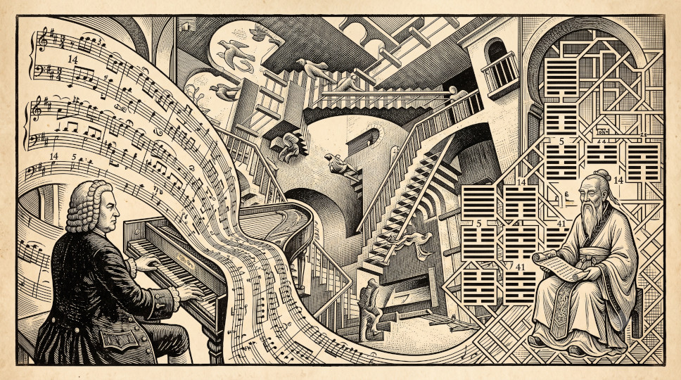
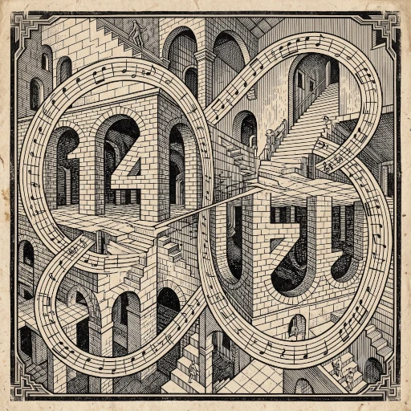


## Introducción

Cuando hablamos de cómo se introdujo el I Ching en Occidente, una de las figuras más conocidas en este contexto es el gran matemático alemán del siglo XVII Gottfried Wilhelm Leibniz, quien conoció el I Ching a través de su famosa correspondencia epistolar con un misionero jesuita en China. Este artículo, sin embargo, no trata de Leibniz y su conexión con el I Ching, sino de otra persona contemporánea a Leibniz y también famosamente asociada con la ciudad de Leipzig: Johann Sebastian Bach. En este artículo investigaremos las conexiones inesperadas de este famoso compositor barroco con el I Ching.

**Advertencia:** Antes de continuar, y en aras del rigor, permítanme aclarar que, si bien Leibniz - que vivió en la misma ciudad unos años antes que Bach- estaba fascinado por la matemática binaria del I Ching, es muy probable que el propio Bach nunca supiera del Libro de las Mutaciones. Sin embargo, nada nos impide mirar la vida y la obra musical de Bach a través del lente del I Ching, y nuestra exploración comienza con la gematría.



---

### Bach y la gematría

La gematría es una forma de numerología que asigna valores numéricos a nombres o frases para revelar sus significados ocultos. Es una práctica central en la Cábala judía y, aunque no hay evidencia de que pensadores y artistas europeos como Newton y Bach la practicaran en el sentido místico estricto, sí mostraron un profundo interés en ella.

Newton, por ejemplo, conocido principalmente como matemático y físico, dedicó en realidad más tiempo al estudio numerológico de las Escrituras que a la física. Y se sabe que Bach integró simbolismo numérico en sus composiciones musicales, aunque esto es objeto de cierta controversia académica.

Por un lado, la idea de que Bach codificó ciertos números - concretamente el 14 y el 41 - en su música mediante la gematría alfabética fue popularizada a mediados del siglo XX por el teólogo y musicólogo alemán Friedrich Smend. Por otro lado, estudiosos como la Dra. Ruth Tatlow (autora de *Bach's Numbers: Compositional Proportion and Significance*, Cambridge University Press, 2015) han cuestionado las teorías gematriales de Smend. Tatlow sostiene que Bach utilizaba un "paralelismo proporcional" (creando armonía matemática entre el número de compases de distintas secciones) más que deletrear su nombre con números.

Esto no debería restar valor a nuestro propósito, porque mientras la musicología tradicional debate hasta qué punto Bach utilizó literalmente el 14 y el 41, los motivos numéricos existen indiscutiblemente en sus obras (como los 14 cánones de las *Variaciones Goldberg*), lo que hace que la conexión arquetípica con el I Ching sea válida independientemente de su intención consciente. Además, la gematría es una práctica que resuena con el énfasis del I Ching en el número como portador de significado.

---

## Los orígenes del 14 y del 41

Bach utilizaba la numerología alfabética (donde A=1, B=2, C=3, etc.) para incrustar su nombre en sus composiciones.

* **Número 14 (BACH):**
    
    Calculado como B(2) + A(1) + C(3) + H(8) = 14. Representa su identidad terrenal y su oficio. Dejó famosamente inconclusa *El arte de la fuga* en el compás 14 de la fuga final, donde se deletrea su nombre en notas (si bemol, la, do, si natural).
    
    El número 14 (BACH), derivado únicamente del apellido, representa a Bach el hombre, el artesano y el compositor. Es su firma finita y humana incrustada en la complejidad infinita de la obra. En el contexto luterano de Bach, el apellido significa el linaje terrenal, el artesano humano y la identidad mortal. Es la firma de la "carne", y también podría decirse que es su firma "inacabada", cuyo ejemplo más profundo se encuentra en *El arte de la fuga*. La última pieza, *Contrapunctus 14*, se interrumpe exactamente en el compás 239 (2+3+9=14). En ese momento preciso, Bach introduce el motivo B-A-C-H (su nombre) como sujeto. La música se detiene a mitad de compás, simbolizando que el "yo" (14) ha llegado a su límite y la muerte ha interrumpido la obra.

* **Número 41 (JSBACH):**
    
    Calculado como J(9) + S(19) + B(2) + A(1) + C(3) + H(8) = 41. Representa su "yo" completo, a menudo interpretado como el individuo (Bach) al servicio de lo divino. Al añadir las iniciales J y S, Bach invoca su nombre completo (identidad), que dedicó famosamente a Dios (*Soli Deo Gloria*). La inclusión de los nombres de pila eleva el número de una mera etiqueta familiar a un alma completa que se presenta ante lo Divino.
    
    Es notable que 41 sea el reverso de 14, reflejando el uso frecuente de contrapunto retrógrado (hacia atrás) de Bach, simbolizando el reflejo de lo humano en lo divino y viceversa.

## La interacción del 14 y el 41

Si 14 es lo humano que mira hacia adelante en el mundo, 41 (el reverso) simboliza lo humano que se vuelve hacia atrás o hacia arriba, hacia Dios. Cabe preguntarse, en el contexto de la numerología, por qué debe ser que 14 represente su identidad terrenal y 41 su alma dedicada a Dios, y no al revés.

Si 41 fuera el "yo terrenal" y 14 el "divino", el simbolismo implicaría que añadir sus iniciales (J+S) lo reduce a un estado más simple y terrenal, lo que contradice la intención teológica de expandir la propia identidad para incluir la vocación cristiana. El movimiento del 14 al 41 es una expansión (añadir J+S), que refleja el viaje espiritual de añadir la fe y la vocación al nacimiento natural. Los estudiosos señalan que Bach solía utilizar el 41 en contextos que lo vinculaban explícitamente con la Trinidad o el Espíritu Santo (por ejemplo, un motete con 123 compases, donde \(3 \times 41 = 123\), vinculando "3" con la Trinidad y "41" con Bach). Esto confirma que 41 es el número del yo integrado espiritualmente, no del yo terrenal básico.

En resumen, 14 es la raíz (el hombre terreno), y 41 es la flor (el hombre plenamente realizado en Dios), siendo la inversión la metáfora musical del reflejo espiritual.

---

## Los números característicos de Bach vistos a través del I Ching

Si trasladamos los números característicos de Bach al I Ching, los significados coinciden asombrosamente bien con su filosofía espiritual.

**[Hexagrama 14 - 大有 Ta Yu (La Gran Posesión)]({})** , compuesto por los trigramas Fuego sobre Cielo, es el sol en su cenit, simbolizando abundancia, riqueza y claridad, pero más concretamente, este hexagrama enfatiza que la "gran posesión" requiere humildad y mayordomía; el talento es un don que debe compartirse. Esto refleja perfectamente la filosofía de Bach de *Soli Deo Gloria* (A Dios solo la gloria). Su enorme producción (la "gran posesión" de música) fue gestionada con rigurosa disciplina y destinada al servicio de la iglesia y a la ilustración de los oyentes, no meramente a la fama personal.

**[Hexagrama 41 - 損 Sǔn (Disminución)]({})** , compuesto por los trigramas Montaña sobre Lago, simboliza la disminución, la simplificación y el sacrificio. Sugiere que para fortalecer lo espiritual (la montaña), uno debe disminuir el ego o lo material (el lago). Se trata de refinamiento mediante la sustracción.

Esto resuena con las rigurosas restricciones del contrapunto y la fuga. Bach a menudo "disminuía" la libertad musical imponiendo reglas matemáticas estrictas, pero esta limitación daba como resultado un "aumento" espiritual. El número 41, al ser el reverso de 14, también se alinea con el tema del hexagrama 41 sobre la inversión: disminuir lo inferior para beneficiar lo superior, así como Bach invertía sus temas musicales para revelar un orden divino oculto. De hecho, ¡esta es la definición exacta del contrapunto de Bach! Bach disminuyó intencionadamente la libertad musical bruta y los impulsos indómitos, sometiéndolos a las estrictas y rigurosas reglas de las fugas matemáticas, para lograr una arquitectura espiritual elevada.

---

## La alquimia del 5

Numerológicamente, el 14 y el 41 se reducen ambos a 5. Las ecuaciones \(1+4=5\) y \(4+1=5\) introducen una tercera dimensión: la síntesis. En ambos sistemas, el número 5 actúa como una resolución dinámica entre la posesión (14) y la disminución (41).

Consideremos la narrativa: un artista recibe un talento inmenso o una "gran posesión": este es el Hexagrama 14. El artista no puede dejar que ese talento se desboque. Debe domar sus impulsos, disminuir su ego y hacer el trabajo riguroso y terrenal de construir la estructura, lo que para Bach significaba las estrictas reglas matemáticas del contrapunto. Estas reglas restrictivas son la encarnación del Hexagrama 41. Una vez que el artista construye la estructura, no puede forzar que el arte cobre vida ni exigir que Dios lo bendiga inmediatamente (gracia divina).

En la teología luterana, a la que Bach se adhería, el número 5 simbolizaba con frecuencia las cinco llagas de Cristo. Bach solía utilizar grupos de cinco notas o texturas a cinco partes para aludir sutilmente al sufrimiento, la gracia y la redención (por ejemplo, el motivo del "suspiro de cinco notas" en la *Pasión según San Juan*). Los conjuntos de Bach suelen implicar una culminación en el número 5 o 6. Por ejemplo, su *Partita n.º 5* es conocida por su carácter expansivo, casi improvisatorio, que sirve como pivote central en sus colecciones para teclado. Por lo tanto, en la música de Bach, el 5 representa la gracia y la quinta justa, la estabilidad armónica definitiva.

En el I Ching, el **[Hexagrama 5 es Hsü (La Espera / El Nutrimiento)]({})** . Wilhelm explica que el Hexagrama 5 significa que "todos los seres necesitan el nutrimiento que viene de arriba", pero, crucialmente, "la entrega del alimento tiene su tiempo, que debe ser esperado". En este marco, el Hexagrama 5 representa el estado activo y preparado del artista. El artista ha hecho el duro trabajo de disminuir el ego (41), y ahora debe esperar que el "nutrimiento de arriba" llene la estructura que ha construido. El Hexagrama 5 es el estado de mantener la fuerza interior mientras la tormenta se acumula: "movimiento en medio del peligro... sin dejarse adormecer por la tranquilidad del reposo" (Wilhelm).

Esta narración que entreteje los hexagramas 14, 41 y 5 apunta al concepto taoísta de *Wu Wei*, o "acción sin esfuerzo", aunque este epíteto puede inducir a error. La gente suele malinterpretar el *Wu Wei* como simplemente no hacer nada o dejar que la naturaleza salvaje siga su curso. Pero si solo se tiene el Hexagrama 14 (la Gran Posesión / talento y energía en bruto), actuar puramente por instinto lleva al caos egocéntrico. El talento en bruto sin estructura no es *Wu Wei*; es solo ruido. Para lograr la acción sin esfuerzo, primero hay que hacer el trabajo más difícil: apartar el ego del camino. Esto es el Hexagrama 41 (Disminución). Wilhelm afirma que esto requiere "domar los impulsos" y sacrificar el yo inferior por la vida espiritual superior. Literalmente, estás "disminuyendo" tu voluntad consciente y forzada para que una ley natural superior pueda tomar el control. Una vez que el ego ha disminuido y la estructura está construida, se llega al Hexagrama 5 (La Espera / Nutrimiento). Wilhelm aclara explícitamente que esta espera "no significa abandonar la empresa... la obra se llevará a cabo". Esta es la definición misma de *Wu Wei*: es un estado de receptividad activa suprema, donde la obra se realiza por sí misma sin tu interferencia forzada.

Afirmar que Bach fue un practicante consciente del *Wu Wei* sería, por supuesto, una especulación histórica. Pero considerando su genio musical prolífico y casi sobrenatural, ¿cómo podría haber producido semejante volumen de obra divina si no fuera a través de la 'acción sin esfuerzo' del *Wu Wei*? En el I Ching, el Hexagrama 5 enseña que "todos los seres necesitan el nutrimiento que viene de arriba", pero que esta lluvia no puede ser forzada; debe ser esperada. Bach construyó los rigurosos recipientes matemáticos de sus fugas, pero no forzó la música. Simplemente preparó el terreno, disminuyó su ego y permitió que la lluvia divina de la inspiración llenara sin esfuerzo las estructuras que había construido.

---

## Referencias

**Tatlow, R.** (2015). *Bach's numbers: Compositional proportion and significance*. Cambridge University Press.

**Wilhelm, R.** (1975). *I Ching: El libro de las mutaciones* (D. J. Vogelmann, Trad.). Editorial Sudamericana.