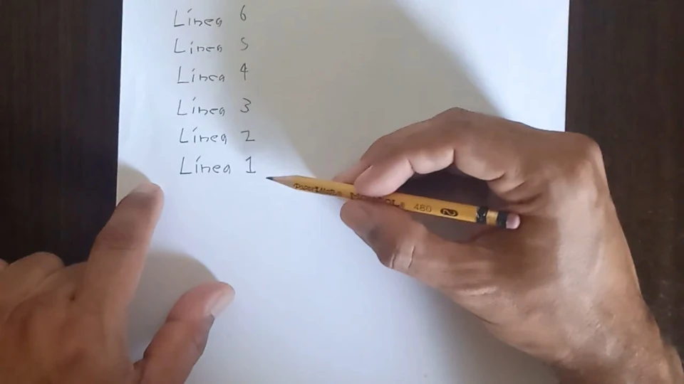

## La milenrama y las monedas- dos métodos tradicionales para consultar el I Ching

El proceso de consultar al I Ching, y de cualquier oráculo en realidad, implica el [azar]() - algo que no depende de nuestra intención consciente. A saber, existen dos métodos de azar para la consulta del I Ching: una con los tallos de milenrama, y la otra con el lanzamiento de tres monedas.

La milenrama (Achillea millefolium) fue utilizada en el oráculo del I Ching principalmente por su disponibilidad, resistencia y simbolismo ritual, aunque no era la única opción botánica en la antigüedad. Era una planta bastante común y fácil de encontrar en las cercanías de áreas sagradas. Sus tallos eran resistentes cuando se secaban, lo que permitía conservar las 50 varillas necesarias para el ritual durante largos periodos. Además, según la cosmogonía tradicional china, se consideraba una planta sagrada que incorporaba el qi (fuerza vital) de la naturaleza; se creía que usar tallos recolectados localmente conectaba al adivinador con las energías específicas de su entorno.


  
El proceso de consulta con los tallos de milenrama es complejo, lento y laborioso, pudiendo durar hasta 20 o 30 minutos, lo cual no es malo en sí, porque la lentitud del proceso ritual fomenta un estado mental meditativo y receptivo, necesario para interpretar la respuesta del oráculo. A partir de la dinastía Han, y consolidandose su popularidad durante la dinastía Song del Sur (1127-1279 d.C.), se empezaron a usar las tres monedas para consultar el I Ching, lo cual hizo la consulta del Libro de las Mutaciones más accequible y sencilla.

La expansión del I Ching en Occidente, gracias a las traducciones de este libro como la de Richard Wilhelm, resulto en la estandardarización del método de las monedas. Incluso en nuestros días, es común que al comprar un ejemplar del I Ching, se incluyan tres monedas chinas con el cuadrado en el centro adjuntas. En este artículo hablaremos sobre el método de consulta mediante las tres monedas.

---

## Requisitos previos para consultar el I Ching

Para consultar al I Ching por este método, se necesitan trés monedas idénticas. No tienen que ser las monedas tradicionales chinas a las que me referí anteriormente. No tienen que ser de un tipo especial, simplemente que sean iguales, es lo importante. Esas tres monedas las limpiará y las guardará en un sitio seguro. Sólo deberá manipularlas usted para consultar al I Ching. 

Antes de lanzar las monedas, es importante meditar bien sobre la pregunta, y crear un vacío, o wújí, si se quiere, para permitir que el oráculo nos hable. Mantener la tranquilidad durante todo el ritual de consulta del oráculo, y la atención enfocada en nuestra pregunta, es lo esencial.

Consultar el I Ching requiere una actidud y disposición mental especial. También requiere meditar sobre la pregunta para plantearla de una forma más precisa. Sobre esto hablamos en otro artículo.

---

## ¿Cómo obtener las 6 líneas del hexagrama?

Pasemos entonces a hablar de cómo obtenemos las 6 líneas de un hexagrama a partir de 6 lanzamientos de trés monedas. Comencemos por aclarar que a la cara de una moneda Ⓒ le asignamos un valor de 3, y la a sello Ⓢ, un valor numérico de 2. En la numerología del Yi Ching, los numeros impares son Yang, y los pares, Yin.

Cuando uno lanza tres monedas y sumamos los tres valores numéricos de las monedas, hay cuatro posibles resultados: 6, 7, 8 o 9.

Si obtenemos tres sellos, sumando sus valores númericos nos da 6. Seis es un número par, por lo tanto es una línea Yin que muta a Yang y se denota de la siguiente manera:

6 ━━━x━━━

Si obtenemos dos sellos y una cara, sumando sus valores numéricos nos da 7, un número impar. Es por lo tanto una línea Yang que se escribe como un solo trazo continuo:

7 ━━━━━━━

Si obtenemos un sello y dos caras, la suma total nos da 8 - un número par- y por lo tanto una línea Yin, que se escribe como un trazo partido en dos:

8 ━━╸ ╺━━

Finalmente, si las tres monedas son cara, la suma total es 9. 9 es impar y por lo tanto tenemos una línea Yang que muta a Yin y se escribe de la siguiente manera:

9 ━━━o━━━

-----

Ahora vamos a explicar cómo es el proceso de consultar al I Ching. Necesitamos tener un espacio con una mesa donde podamos sentarnos tranquilos y lanzar las monedas sin ser molestados. También necesitaremos tener papel y lápiz a la mano. Y por supuesto, las tres monedas.

Asumiendo que previamente hemos formulado nuestra pregunta al I Ching, la anotaremos en papel y lápiz. Escribir la pregunta nos ayuda a aclarar bien nuestras ideas y así estaremos mejor preparados para recibir la respuesta del oráculo. Llevar una especie de diario para el I Ching donde anotemos todas nuestras consultas, con las preguntas y respuestas del oráculo, no es mala idea. 

El proceso de consultar al I Ching consistirá en lanzar las tres monedas 6 veces, lo cual nos dará el valor numérico de cada una de las 6 líneas del hexagrama, según acabamos de ver. Enumeraremos en el papel los 6 renglones para las 6 líneas, comenzando con la línea 1 abajo y terminando en la línea 6 arriba.

---

## Simulacro de lanzamiento de las monedas para obtener un hexagrama resultante

En lo que sigue, haremos un simulacro de consulta como ejemplo. Comenzamos lanzando las 3 monedas para obtener la línea 1 inferior, y repetimos este proceso 5 veces más para obener las demás líneas. 

El primer lanzamiento de tres monedas nos da la línea 1, que es la línea inferior. Aquí obtuvimos dos sellos y una cara, por lo tanto su valor es 7 - una línea yang. Anotamos el valor de 7 y su representación gráfica junto a la línea 1.

El segundo lanzamiento de tres monedas nos da la línea 2. Aqui obtuvimos tres caras. Eso nos da un valor de 9, lo que se corresponde a una línea Yang que muta a Yin. Anotamos esto al lado de la línea 2.

De esta forma, vamos lanzando las tres monedas sucesivamente para obtener la línea 3, la línea 4, línea 5 y finalmente la línea 6. En la tabla abajo resumimos todo el resultado

| Línea   | Lanzamiento de monedas | Línea resultante |
|:-------:|:--------:|:---------:|
| 6       | Ⓢ+Ⓢ+Ⓒ | 7 ━━━━━━━ |
| 5       | Ⓒ+Ⓒ+Ⓢ | 8 ━━╸ ╺━━ |
| 4       | Ⓒ+Ⓒ+Ⓒ | 9 ━━━o━━━ |
| 3       | Ⓢ+Ⓢ+Ⓒ | 7 ━━━━━━━ |
| 2       | Ⓒ+Ⓒ+Ⓒ | 9 ━━━o━━━ |
| 1       | Ⓢ+Ⓢ+Ⓒ | 7 ━━━━━━━ |

Este es el resultado de nuestra consulta, pero todavía no es inteligible para nosotros. ¿Qué se supone que debemos hacer con los valores de las seis líneas?

Lo primero que tenemos que hacer es sacar el hexagrama resultante (tercera colúmna). El **hexagrama resultante** describe la situación manifiesta que se presenta ante nosotros en referencia a la pregunta que hicimos. Considerando que para el hexagrama resultante, los 7 y 9 son Yang y los 8 y 6 son Yin, simplemente sustitiumos un 7 o un nueve por un trazo continuo: ━━━━━━━. El 8 o el 6 nos da en cambio una línea Yin: ━━╸ ╺━━.

Si hay líneas mutantes (6 o 9), obtendremos un segundo hexagrama, llamado el **hexagrama derivado**, que nos muestra como podría evolucionar la situación en el futuro. Si no hay líneas móviles, se dice que el hexagrama obtenido es un **hexagrama estático** y en ese caso, la situación no está cambiando y la sentencia general del I Ching sobre el hexagrama obtenido ofrece suficiente clarificación.

Pero como en nuestro ejemplo, la línea 2 y la línea 4 son nueves, esas dos líneas móviles nos dan un hexagrama derivado. Sustitumos los 6 ━━━x━━━ por Yang (━━━━━━━) y los 9 ━━━o━━━ por Yin (━━╸ ╺━━). En conjunto, tenemos el resultado como en la siguiente tabla: 

| Línea    | Línea resultante | Hexagrama resultante | Hexagrama derivado |
|:-------:|:---------:|:-------:|:-------:|
| 6       | 7 ━━━━━━━ | ━━━━━━━ | ━━━━━━━ |
| 5       | 8 ━━╸ ╺━━ | ━━╸ ╺━━ | ━━╸ ╺━━ |
| 4       | 9 ━━━o━━━ | ━━━━━━━ | ━━╸ ╺━━ |
| 3       | 7 ━━━━━━━ | ━━━━━━━ | ━━━━━━━ |
| 2       | 9 ━━━o━━━ | ━━━━━━━ | ━━╸ ╺━━ |
| 1       | 7 ━━━━━━━ | ━━━━━━━ | ━━━━━━━ |

---

## Ubicando el hexagrama resultante y derivado en una tabla.

Para cada hexagrama, nos fijamos en su **trigrama inferior** (líneas 1-3) y en su trigrama superior (líneas 4-6). El hexagrama resultante tiene ☰ Cielo como trigrama inferior y ☲ Fuego como trigrama superior. Por medio de [nuestra tabla de referencia](/hexagramas/tabla-hexagramas), encontramos que el hexagrama resultante es el Nᵒ 14 - Gran Posesión / Dà Yǒu / 大有.

Análogamente el hexagrama derivado tiene como trigrama inferior ☲ Fuego y como trigrama superior ☶ Montaña. Según la tabla de ubicación de los hexagramas ya mencionada, el hexagrama derivado es el Nᵒ 22 - La Elegancia / Bì / 贲.

---

## ¿Qué sigue ahora?

El propósito de este artículo es familiarizar al lector con el proceso mecánico de la consulta: cómo lanzar las monedas para obtener las 6 lineas que nos dan la respuesta del oráculo a nuestra pregunta. Esa respuesta consta de un hexagrama resultante, y si hay líneas móviles, tendremos también un hexagrama derivado. Tambíen hemos visto como ubicar (identificar) esos hexagramas en una tabla de ubicación de hexagramas.

Esta es la parte mecánica del proceso de consulta y hay otros aspectos sobre los cuales hablaremos en otro artículo:

* ¿Cómo se debe formular la pregunta? 
* ¿Hay algún ritual especial que debe seguirse al momento de consultar el I Ching? ¿Cómo debe ser nuestra actitud durante el proceso de consulta?
* ¿Cómo interpretamos los hexagramas resultantes y derivados?

La interpretación de los hexagramas es un arte que se va perfeccionando con la experiencia, por lo cual en ese otro artículo tampoco daremos una respuesta exhaustiva a la última pregunta. Sin embargo, como última parte de este artículo, esbozaremos algunos conceptos y principios sobre cómo interpretar.

Para cada hexagrama en el texto del I Ching, encontraremos dos componentes - el "juicio" o "dictamen" y la "imagen". Ambos componentes son complementarios y ofrecen diferentes perspectivas sobre el significado de un hexagrama.

Mientras que el juicio ofrece una interpretación directa y conceptual de la situación, la imagen proporciona una representación simbólica y poética que enriquece la comprensión y ayuda a aplicar el consejo en contextos concretos.

Existe otro componente que nos proporciona información para interpretar los hexagramas- estas son las líneas móviles. Si obtenemos un valor de 6 o 9 para algúna línea, tendremos lo que se llaman líneas móviles. Son lineas Yin que mutan a Yang o líneas Yang que mutan a Yin. En el texto del I Ching para cada hexagrama, las líneas móviles nos proporcionan consejos especificos para nuestra pregunta.

Si hay líneas móviles, tendremos un segundo hexagrama, que nos muestra como podría evolucionar la situación en el futuro. A este segundo hexagrama lo llamamos el hexagrama futuro. Se obtiene a partir de los valores de las líneas según los lanzamientos de las monedas en donde los seis se cambian a Yang (siete) y los nueve a Yin (ocho). Una vez más, identificamos este nuevo hexagrama en la tabla y leemos en el texto su dictamen e imágen.

Los textos contentivos del dictamen, la imágen y las líneas móviles de cada hexagrama se pueden ubicar en nuestro sitio siguiendo los enlaces de cualquiera de las tablas de referencia de hexagramas.

---

## Conclusión e invitación a experimentar

Esto ha sido solo el primer paso en el vasto arte de consultar e interpretar el I Ching. Cada hexagrama encierra múltiples capas de significado y conexiones por descubrir. El verdadero aprendizaje comienza con su propia experiencia, así que te invito a experimentar e iniciar tu diálogo personal con la sabiduría del I Ching.

---

### Complementa la lectura con el video:

Si prefieres profundizar en estos conceptos de forma visual y escuchar el análisis detallado, te invito a ver la lección completa en mi canal:

