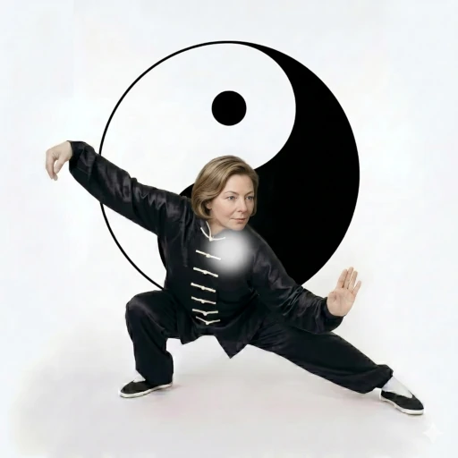
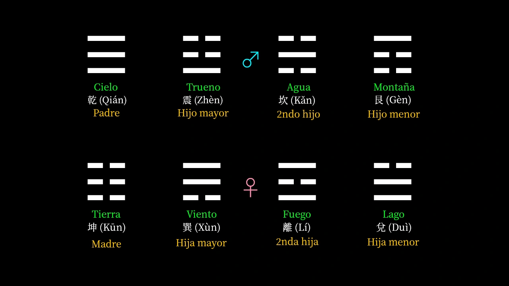
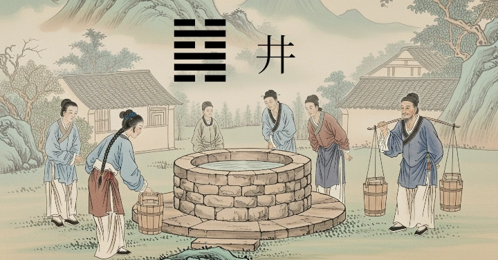
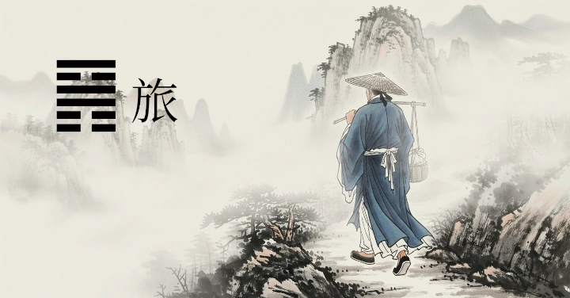

## ¿Qué es el I ching?

El I Ching, o libro de las mutaciones, es al mismo tiempo un libro y una herramienta. Como libro es una fuente de sabiduría, que nos enseña como el universo es un constante fluir. Esto nos recuerda a lo que planteaba el filósofo griego [Heráclito, cuando decía que todo se encuentra en un proceso de transformación continua, donde las cosas se convierten en sus opuestos.]()

Como herramienta, es una brújula virtualmente infalible para orientar al ser humano a cómo lograr la armonía con el constante y cambiante fluir de las corrientes de la vida. La mayoría de las personas lo conocen bajo este aspecto de herramienta, como oráculo o práctica divinatoria.

Sin embargo, muchos podrían pensar que el I Ching es una instancia externa que nos da respuestas desde afuera de nosotros mismos, o que nos ayuda a predecir el futuro. Nada más alejado de la verdad.

Ciertamente, el I Ching nos ayuda a encontrar respuestas, pero eso es porque aquello que nosotros pensamos que está "allá afuera", se encuentra dentro de nosotros mismos y lo que nosotros vemos allá afuera, es un reflejo de lo que somos. En este sentido, más que una brujula, el I Ching es el espejo definitivo.

Pero también podriamos ver el I Ching como un lenguaje, y en este artículo vamos a ver cómo es este lenguaje y cuales son sus partes constituyentes. ¿Cuál es el alfabeto del I Ching y cuales son sus palabras y sentencias? Por eso hemos titulado este articulo "El ABC del I Ching", porque además de ser una introducción al mismo, nos dice cómo es el lenguaje con el que el I Ching nos habla cuando lo consultamos.

## El alfabeto binario del I Ching{#libro-sin-palabras}

En su origen, el I Ching es un libro sin palabras. Es una sucesión finita de signos no idiomáticos que conforman una cosmogonía. Estos signos representan los posibles estados de la realidad y de la condición humana. Los signos son en total 64, y se denominan *hexagramas*. Cada hexagrama, como veremos luego, se compone de 6 trazos lineales.

El I Ching puede ser considerado como análogo a un Automata de Turing, en el sentido en que el I Ching nos indica bajo cales condiciones se pasa de un estado a otro. Y como las computadoras digitales de ahora, el I Ching también se basa en un sistema binario, hecho que sorprendió bastante al Leibniz, un matemático alemán del siglo 18. Pero sobre Leibniz y el I Ching hablaremos en otro artículo...

Este sistema binario de dos elementos opuestos es central al pensamiento chino. Seguramente ustedes conocerán este símbolo: ☯. En occidente comúnmente lo llaman el símbolo del Yin y el Yang, pero su nombre es el Taijitu. Este símbolo representa el Taiji, o la gran polaridad. Es la fuerza universal diferenciada en dos polos: Yin y Yang. Lo femenino y lo masculino. Lo oscuro y lo luminoso. Negativo y Positivo. Tierra y Cielo.

Estos polos opuestos no son antagónicos, sino más bien complementarios - su interacción da origen a toda la creación fenomenológica. Si observamos cuidadosamente el símbolo del Taiji, nos damos cuenta que cada polo tiene la semilla de su opuesto, y que un polo se sigue al otro en una sucesión infinita, como el día sigue la noche. Esta idea de mutabilidad y sucesión cíclica de opuestos esta presente en todo el tejido del I Ching.

El Yin y el Yang son pues, los elementos binarios fundamentales, o las letras, a partir de los cuales se construyen los 64 hexagramas del I Ching. El *Yin*, que representa lo femenino y oscuro, se representa por un trazo lineal partido en dos, así: ⚋. El *Yang*, en cambio, que representa lo masculino y luminoso, se representa por un trazo lineal completo, así: ⚊.

## Los trigramas (las palabras)

Apilando tres trazos Yin o Yang uno encima de otro, obtenemos los 8 *trigramas*, que en su conjunto se denominan los *Bagua*. Estos ocho trigramas son símbolos fundamentales que representan ocho aspectos fundamentales de la naturaleza. Cada trigrama tiene un nombre, esta asociado a un genero, guarda una relación familiar con los otros trigramas, y tiene una cualidad o imagen.

Por ejemplo, tres lineas Yang nos dan el trigrama ☰ Qián (乾), que representa el Cielo, el padre, el espíritu, la energía, lo creativo y la semilla creadora. En cambio tres líneas Yin nos dan el trigrama ☷ Kūn (坤), que representa la Tierra, la madre, lo receptivo, y va asociado a la feminidad, la nutrición y la fecundidad. Sobre los ocho trigramas ahondaremos en otro artículo.

## Los hexagramas (las oraciones)

A su vez, con una pareja de trigramas, uno encima del otro, obtenemos los 64 hexagramas, que constituyen imágenes representativas de situaciones universales, tanto en el plano terrenal, celestial o humano. A veces, los nombres de estos hexagramas aluden a conceptos un tanto abstractos, como por ejemplo "La Posesión de lo Grande", o "La Modestia", que son los hexagramas 14 ([䷍](/hexagramas/hex14/)) y 15 ([䷎](/hexagramas/hex15/)), respectivamente. Otras veces, los hexagramas aluden a entidades más concretas, como es el caso del hexagrama 48 ([䷯](/hexagramas/hex48/)) - "El Pozo de Agua" y el hexagrama 56 ([䷷](/hexagramas/hex56/)) - "El Andariego".

Por ejemplo, juntando el trigrama de ☷ Kūn (坤), que representa la tierra, con el trigrama de ☲ Lí (离), que representa el fuego, obtenemos el hexagrama 35 ([䷢](/hexagramas/hex35/)) en la secuencia, cuyo nombre es Jìn (晉) , o el progreso. Su imagen es la del sol sobre la tierra, que representa una expansión y claridad de alcance cada vez mayor. 

En resumen, el I Ching se nos revela como un lenguaje universal. Un alfabeto binario de Yin y Yang da forma a las ocho palabras primordiales de los trigramas, que a su vez se combinan en las sesenta y cuatro sentencias de los hexagramas: un diccionario ancestral cuya sabiduría nos permite leer la realidad y sus infinitas mutaciones.

---

### Complementa la lectura con el video:

Si prefieres profundizar en estos conceptos de forma visual y escuchar el análisis detallado, te invito a ver la lección completa en mi canal:


