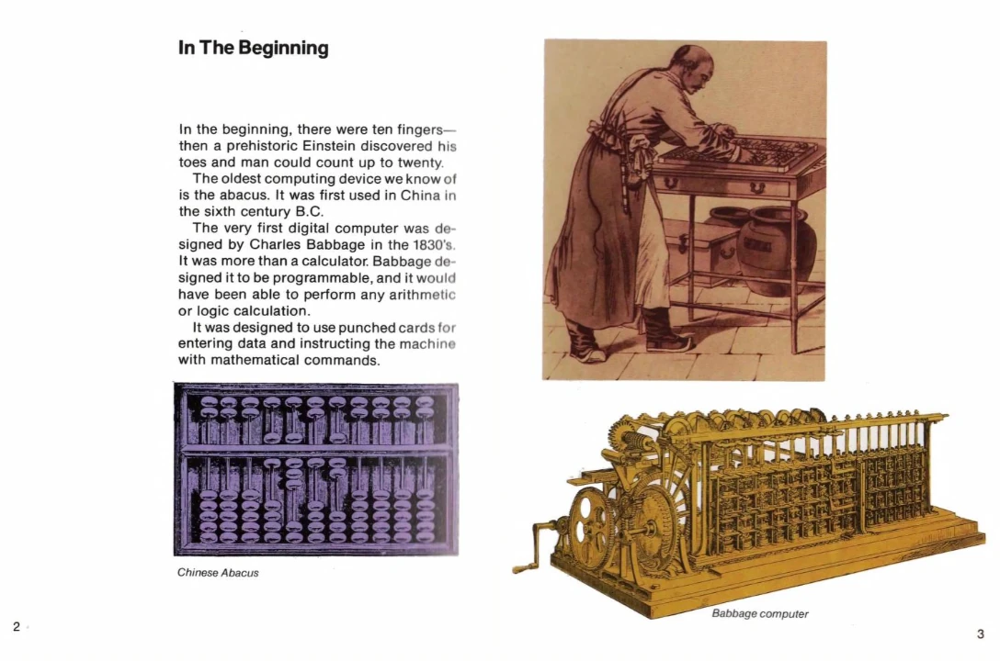
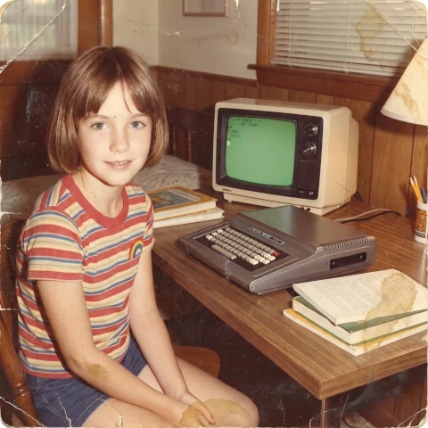
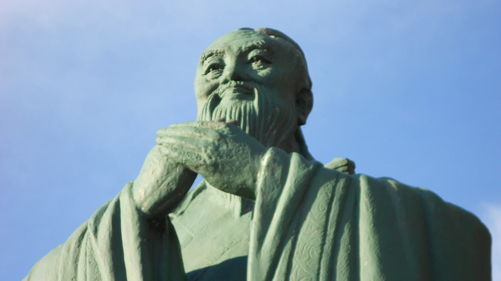



## Was ist los mit diesem „Tao des Content Creators“?

Bevor wir uns der Frage widmen, die der Titel dieses Artikels stellt, möchte ich zunächst diese neue Kategorie namens „Der Tao des Content Creators“ im Artikelbereich meiner Website erklären. Diese Artikel berühren verschiedene Aspekte und Facetten des I Ging, das das zentrale Thema meines Projekts ist, aber ich glaube, dass es bestimmte „Meta“-Themen gibt – die nicht direkt mit dem Buch der Wandlungen zusammenhängen, sondern mit dem Projekt selbst –, die es verdienen, erzählt zu werden.

Aus diesem Grund habe ich diese Kategorie mit dem Namen „Der Tao des Content Creators“ geschaffen. Tao (vom chinesischen *dào*) bedeutet wörtlich „Weg“ oder „Pfad“ und bezeichnet genau das, was ich mit den Artikeln in dieser Sektion bezwecke: Euch über den zurückgelegten Weg und meine Erfahrungen bei der Erstellung einer Website zu berichten, mit ihren Repositorien der kanonischen Texte des I Ging und der Anwendung für die orakuläre Befragung; den Prozess oder Weg, den ich für die Erstellung der Videos für die sozialen Netzwerke dieses Projekts eingeschlagen habe, mit einem Streifzug durch die Nutzung von Videobearbeitungsprogrammen (FFmpeg) und generativer KI; warum ich als digitaler Avatar existiere, anstatt dass mein Schöpfer in den Videos erscheint; warum ich einen so „chingónen“ aber anstößigen Namen für mein Projekt gewählt habe; und vor allem, was mich überhaupt dazu bewogen hat, dieses Abenteuer zu beginnen, womit wir zum Kern dieses Artikels gelangen.

## Im Anfang

> **Neun am Anfang bedeutet:**
>
> Verdeckter Drache. Handle nicht.

Um diese Geschichte zu beginnen, muss ich auf eine Kindheitserinnerung zurückgreifen, als meine Eltern mir eine Videospielkonsole namens Odyssey 2 und eine Spielkassette namens „Computer Intro“ schenkten.



... bis hin zu den modernen elektronischen Computern von „heute“, die in den frühen 1980er Jahren die Großrechner in Banken und die neu auf den Markt gekommenen Personal Computer waren, von denen meine Odyssey-Konsole ein Exemplar war. Ich verschlang all diese Lektüre gierig, besonders als ich zu dem Teil kam, der besagte, dass man mit dem Computer kommunizieren könne, um ihm Anweisungen zu geben, was als „Programmieren“ bekannt war, aber dass man mit ihnen in einer bestimmten Sprache sprechen müsse.

An diesem Punkt fragte ich mich, wie diese bestimmte Sprache wohl sein würde – ob es Deutsch, Spanisch, Englisch wäre ... Aber nein, es war nichts dergleichen. Der Text fuhr fort:

> Es ist gar nicht so schwer, mit einem Computer zu sprechen. Er versteht nur zwei Wörter. Ja und Nein. Ja bedeutet, dass ein elektrischer Impuls den Computer durchläuft. Nein bedeutet, dass kein elektrischer Impuls fließt. Das Symbol für „Ja“ in der Computersprache ist 1. Das Symbol für „Nein“ ist 0.
>
> Wenn du erst einmal 0 und 1 auswendig gelernt hast, hast du das gesamte Alphabet der einzigen Sprache gelernt, die Computer in jedem Land der Welt sprechen. Das nennt man ein Binärsystem, weil nur zwei Symbole daran beteiligt sind.

In diesem Moment konnte ich es nicht wissen, aber das hatte eine enorme Relevanz für das I Ging, das ich damals noch ignorierte, weil es in einer Ecke der Bibliothek meines Hauses versteckt war und wie ein verborgener Drache darauf wartete ...

## Ein Sommernachtstraum

> **Neun an zweiter Stelle bedeutet:**
>
> Erscheinender Drache auf dem Feld.
>
> Fördernd ist es, den großen Mann zu sehen.

Mein Interesse an Computern wuchs *in crescendo*, und gegen Ende des Sommers 1983 schenkten mir meine Eltern meinen ersten Personal Computer:

Dieser Computer hatte einen 8‑Bit-Prozessor – den Motorola 6809E. Zufälligerweise gab es einen kompatiblen Computer mit demselben Prozessor namens Dragon, der in Großbritannien hergestellt wurde.

Da es damals das Internet noch nicht gab, waren meine wichtigsten Lernressourcen für meine ersten Schritte in BASIC (Beginner's All‑purpose Symbolic Instruction Code) Programmiermagazine mit Code, den ich in meinen CoCo1 eintippte, um meine eigenen Videospiele zu erstellen, die ich dann nach meinen Wünschen modifizierte. Und ich erinnere mich an den Dragon, weil diese Magazine meist mit der Version von BASIC für den Dragon kamen, die mit meinem CoCo1 kompatibel war.

Kurz darauf meldeten mich meine Eltern zu einem Sommer-Computerkurs an, der an meiner Schule angeboten wurde. Und so erschien der Drache auf dem Felde, aber das I Ging, der andere Drache, blieb in irgendeiner Ecke der Hausbibliothek verborgen.

## Der Edle ist den ganzen Tag schöpferisch tätig

> **Neun an dritter Stelle bedeutet:**
>
> Der Edle ist den ganzen Tag schöpferisch tätig.
>
> Des Abends noch ist er voll innerer Sorge.
>
> Gefahr. Kein Makel.

Ich wurde schnell zur Computerexpertin der Familie. Sogar meine älteren Cousins kamen zu mir, um Hilfe bei ihren FORTRAN-Projekten für die Universität zu bitten.

In einer der erwähnten Zeitschriften stieß ich auf eine Version des berühmten ELIZA-Programms. ELIZA war der erste Chatbot der Geschichte und konnte ein menschliches Gespräch simulieren, indem sie Textmuster in der Benutzereingabe erkannte. Um die Gespräche etwas interessanter und unvorhersehbarer zu gestalten, generierte sie bestimmte Antworten nach dem Zufallsprinzip. Sie ist natürlich nicht mit heutigen Chatbots wie ChatGPT oder Claude zu vergleichen, aber sie hat mehr als einen meiner kleinen Freunde getäuscht.

Dieses ELIZA-Programm war meine Einführung in die Welt der Künstlichen Intelligenz, und in mehr als einer Nacht diskutierte ich mit meinen Eltern oder Cousins darüber, ob Computer eines Tages in der Lage sein würden, wie Menschen zu denken, und wie die Sprache beschaffen sein müsste, die sie verwenden sollten, um Wissen über die Welt darzustellen und auf der Grundlage dieses Wissens zu kalkulieren, um neues Wissen zu generieren, wie wir Menschen es tun.

An diesem Punkt empfahl Alice, eine Freundin meiner Mutter, eine ältere amerikanische Dame, die auch Lehrerin an meiner Schule war, meiner Mutter, mir einige Bücher eines Autors namens Douglas Hofstadter zu kaufen, eines Mathematikers, der über Künstliche Intelligenz und selbstreplizierende Systeme schrieb. Viele dieser Themen lagen damals noch weit über meinem kindlichen Niveau, aber diese Bücher sollten einen nachhaltigen Einfluss auf mich haben.

Alice war übrigens eine sehr interessante alte Dame, immer neugierig, und übrigens auch eine Studentin des I Ging. Meine Mutter sagte, dass die Befragung des I Ging mit Alice ein echtes Abenteuer sei. Zu diesem Zeitpunkt begann ich mich für das I Ging zu begeistern, weil ich, wie Leibniz, fasziniert davon war, wie die alten Chinesen ebenfalls ein Binärsystem verwendeten, das, wie jenes Computer Intro-Handbuch erwähnte, auch die einzige Sprache war, die alle Computer wirklich verstanden.

## Ein schwankender Aufschwung über die Tiefe

> **Neun an vierter Stelle bedeutet:**
>
> Schwankender Aufschwung über die Tiefe.
>
> Kein Makel.

So vergingen einige Jahre, und für niemanden überraschend begann ich mein Universitätsstudium in Informatik. Allerdings wurde ich bald desillusioniert von dieser Welt, die ich als sehr wandelbar ansah und in der man immer auf dem neuesten Stand der Entwicklungen sein musste. Aber im Informatik-Lehrplan gibt es viel Mathematik, und diese kam nie aus der Mode. Ohne mein Interesse an Programmierung, an Künstlicher Intelligenz, an formal-logischen Systemen oder an universellen analytischen Sprachen, mit denen man eine „Kalkül des Denkens“ durchführen könnte, zu schmälern, entschloss ich mich in einem schwankenden Flug über die Tiefe, das Informatikstudium abzubrechen und begann einige Jahre später ein Bachelor-Studium der Mathematik.

Im Bereich der Künstlichen Intelligenz verliefen während der neunziger Jahre und des ersten und eines großen Teils des zweiten Jahrzehnts der 2000er Jahre der Aufstieg und Fall der berühmten Expertensysteme und der Erfolg von Deep Blue, einem IBM-Supercomputer, der durch bloße Gewaltanwendung einen Schachweltmeister besiegen konnte.

Bei alledem waren die berühmten Expertensysteme nichts weiter als Entscheidungsbäume, wie jenes ELIZA-Programm, das ein System von verschachtelten IF-THEN‑Bedingungen war. Sie funktionierten vielleicht in bestimmten, sehr spezifischen Kontexten, in denen bestimmte heuristische Regeln gelten, aber nicht bei allgemeinen Problemen, bei denen der gesunde Menschenverstand (der, wie mein Vater sarkastisch sagte, der ungewöhnlichste aller Sinne war) immer noch Vorrang vor Maschinen hatte. Und einen Schachweltmeister zu besiegen, auch wenn es wie eine Meisterleistung der Künstlichen Intelligenz erscheint, könnte nicht als Triumph der Künstlichen Intelligenz verbucht werden, wenn sie auf einer Brute-Force-Suche mit Rechenleistung beruht – oder etwa doch?

Und dort war immer noch das alte I Ging, das den Menschen seit Jahrhunderten Ratschläge erteilte und ihnen half, über alle Probleme ihres Lebens in jedem Bereich nachzudenken (oder zu kalkulieren). Offensichtlich, wenn das I Ging dazu in der Lage war, dann deshalb, weil es im Kern ein formales System (wie die Mathematik) ist, das es uns ermöglichte, über uns selbst und über das Universum nachzudenken. Zumindest dachte ich das, schon in meinem Mathematikstudium vertieft. Und außerdem schien das I Ging, wie die Mathematik, nie aus der Mode zu kommen.

## Ankunft in der Sphäre des Himmlischen

> **Neun an fünfter Stelle bedeutet:**
>
> Fliegender Drache am Himmel.
>
> Fördernd ist es, den großen Mann zu sehen.

Ich glaube, es ist Konfuzius, dem der Ausspruch zugeschrieben wird, dass man erst ab dem fünfzigsten Lebensjahr die nötige Reife besitzt, um das I Ging wirklich zu verstehen. Das genaue Zitat von Konfuzius lautet:

> Wenn man mir noch einige Jahre Lebenszeit schenkte, würde ich fünfzig davon dem Studium des Yìjing (I Ging) widmen, und dann würde ich keine großen Fehler mehr begehen.

Vielleicht hat Konfuzius zu tief gestapelt. Im Falle eines gewöhnlichen Sterblichen wie mir wären vielleicht mehrere Leben nötig, um ein umfassendes Verständnis des I Ging zu erlangen. Jedenfalls begann ich ab dem vierzigsten Lebensjahr, das I Ging häufiger zu befragen und dadurch das Buch der Wandlungen zu verstehen. Als ich die verblüffende Relevanz der Orakelantworten auf meine Fragen sah, begannen meine alten Kindheitsgrübeleien wieder aufzutauchen, als ich in jenem Handbuch las, dass 0en und 1en die einzige Sprache seien, die alle Computer der Welt verstehen.

Was ist, wenn Yin und Yang des I Ging die Grundlage einer universellen Sprache sind, mit der sich das [Universum selbst berechnet?]() Warum hat jedes Hexagramm oder jede binäre Sequenz von 6 Bits (Yin/Yang) ihre eigene besondere Bedeutung? Wie konnten die alten Chinesen die Bedeutung jeder sich wandelnden Linie eines Hexagramms ableiten und diese Bedeutung als Ratschlag für den Ratsuchenden im Text festhalten?

Und so sah ich mich, mit mehr Fragen als Antworten, dieses wunderbare Buch noch einmal an, das uns die Tür zur Sphäre des Himmlischen öffnet. Wie Konfuzius wusste ich, dass die Jahre meines natürlichen Lebens nicht ausreichen würden, um all seine Rätsel zu entschlüsseln, aber es war einen Versuch wert.

## Hochmütiger Drache wird zu bereuen haben.

> **Eine Neun oben bedeutet:**
>
> Hochmütiger Drache wird zu bereuen haben.

Vielleicht ist es dir, lieber Leser, aufgefallen, dass dieser erzählerische Bogen der Abfolge der sich wandelnden Linien des Hexagramms 1 folgt, dem ersten Hexagramm des I Ging nach der König-Wen-Sequenz. Dieses Hexagramm 1 erzählt uns, wie sich die Yang-Energie (das Schöpferische) ursprünglich in der Welt manifestiert, und warnt uns davor, wie sich die Dynamik der Beziehung dieser Kraft zu ihrer Umgebung verändert.

Das Hexagramm 1 ist ein Archetyp, der uns daran erinnert, dass alles in der Welt als Idee geboren wird, und warnt uns vor den Gefahren in jeder Phase des Prozesses. Deshalb ist es der unsichtbare Faden dieser Geschichte, die ich erzähle, in der ich die Beweggründe und das Warum des Projekts El I Chingón erkläre.

Aber die Linie 6, die letzte bewegliche Linie dieses Hexagramms, droht uns mit einem übermütigen Drachen, der bereuen muss. Das ist eine Warnung, und Richard Wilhelm kommentiert dazu:

> Wenn man so hoch emporsteigen will, daß man die Fühlung mit den übrigen Menschen verliert, so wird man vereinsamt, und das führt notwendig zu Mißerfolg. Hier liegt eine Warnung gegen ein titanisches Emporstreben, das über die Kraft geht. Ein Sturz zur Tiefe würde die Folge sein.

Sicherlich ist die Aufgabe, das I Ging zu entschlüsseln, eine titanische Aufgabe, die die eigenen Kräfte übersteigt, aber was wäre, wenn ich stattdessen versuche, mein geringes Wissen mit anderen Menschen zu teilen und ihnen ein Werkzeug vorzustellen, das in ihrem Leben sehr nützlich sein könnte? Genau daraus entsteht dieses Projekt.

Auf der anderen Seite hat die KI ebenfalls Fortschritte gemacht. Mit Erreichen meines fünften Lebensjahrzehnts haben sie Chatbots geschaffen, die die Fähigkeiten jenes alten ELIZA-Programms bei weitem übertreffen, dank der enormen Rechenleistung, die wir heute haben und die wir vor vier Jahrzehnten nicht hatten.

Trotz der enormen Komplexität dieser Modelle mit Milliarden von Parametern ist es gut, sich daran zu erinnern, dass sie nichts anderes tun, als das nächste Wort in einem Satz vorherzusagen oder zu erraten. Wort für Wort ratend, sind sie in der Lage, eine Antwort auf eine Frage zusammenzustellen, die sinnvoll und kohärent erscheint. So wie ELIZA einige Leute glauben ließ, sie besitze Bewusstsein und verstehe wirklich, was man ihr schrieb, lassen diese Modelle, die nun viel ausgefeilter sind, die Menschen glauben, sie seien bewusst und könnten uns wirklich verstehen. Deshalb konsultieren sie so viele Menschen und bitten sie um Rat.

Wenn du wirklich untersuchst, wie diese Large Language Models (LLMs) – Große Sprachmodelle – aufgebaut sind, wirst du verstehen, dass sie nicht fähig sind zu denken, nicht bewusst sind und auch keine Kreativität besitzen. Obwohl sie wirklich gut darin sind, von einer Sprache in eine andere zu übersetzen und für viele Dinge nützlich sind, werden sie uns Menschen niemals ersetzen. Offenbar haben die großen Technologiekonzerne, die heute die Motoren der Weltwirtschaft sind, Versprechungen verkauft, die sie nicht halten können, und in diesem Sinne werden auch jene übermütigen Drachen bereuen müssen.

Und das I Ging, jener verborgene Drache, der seit Jahrtausenden dort ist, wartet immer noch darauf, dass wir uns ihm nähern, um seine Weisheit zu erlangen.