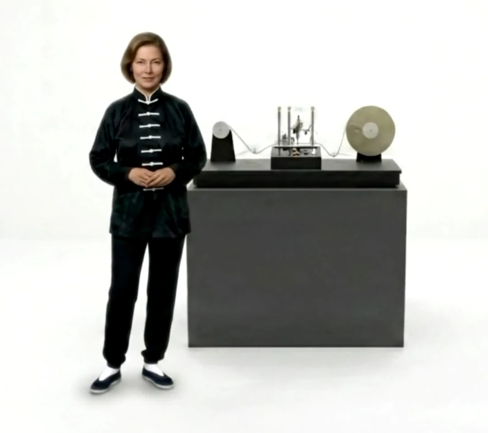


## Was ist das Universum?

Die grundlegendste Frage der Menschheit hat sich nie geändert:

„Was ist das Universum?“

In der antiken Welt antwortete das I Ching (易經): Das Universum ist Wandel (變).

Klopfe mit den Knöcheln auf den Holztisch direkt vor dir. Du nimmst eine feste, dichte, völlig reale Oberfläche wahr. Stell dir nun vor, du erkundest ein Open-World-Videospiel.

Die Berge auf dem Bildschirm wirken gewaltig und texturiert, aber wir wissen genau, dass es sich nicht um reale physische Objekte handelt, die wir anfassen können. Hinter diesen wunderschönen digitalen Sonnenuntergängen verbirgt sich alles Information. Folgen von Nullen und Einsen, die mit atemberaubender Geschwindigkeit miteinander interagieren.

Was wir als feste physikalische Objekte sehen, verhält sich eher wie eine laufende Software, die ständig die Position jedes Atoms aktualisiert. Um zu verstehen, wie dieser Mechanismus funktioniert, werden wir einen 3.000 Jahre alten Text, die Regeln der Quantenphysik und die neuesten Konzepte der künstlichen Intelligenz miteinander verbinden.

> Warnung an den Leser: Wenn wir sagen, dass das I Ching Raum oder Zeit „kodiert“, behaupten wir nicht, dass seine Autoren die Relativitätstheorie oder Informatik kannten. Wir tun, was gute Übersetzer tun: Wir übertragen eine alte Sprache (die des Wandels und der Polaritäten) in die heutige Sprache (die der Bits und Quantenzustände). In diesem Artikel erforschen wir, wie – trotz der tiefgreifenden Unterschiede zwischen Epochen und Sprachen – das I Ching, die Mathematik, die Informatik des 20. Jahrhunderts und die Quantenphysik zu einer bemerkenswert ähnlichen Sichtweise gelangt sind.

---

## Die Kosmogonie des I Ching

Lange bevor es Computer gab, verfassten alte Gelehrte in China einen Text namens I Ching. Sie kamen zu dem Schluss, dass die materielle Welt nicht einfach aus festen Dingen besteht, wie Parmenides und Demokrit annahmen, sondern aus einem unaufhörlichen Fluss von Verwandlungen, wie Heraklit postulierte.

Um dies zu erklären, begannen sie mit einem unteilbaren Zustand und teilten ihn in zwei gegensätzliche Werte, Yin und Yang, eine Wahl zwischen zwei Optionen. Dieses Diagramm zeigt, wie sich die beiden anfänglichen Optionen vervielfachen. Zwei werden zu vier, vier zu acht, ... und so weiter, bis die gesamte Vielfalt der möglichen Dinge auf der Erde ausgeschöpft ist, wie im Kapitel IX des Großen Traktats (Ta Chuan) der berühmten „Zehn Flügel“ oder Anhänge des I Ching ausgeführt:

> Die acht Zeichen bilden eine kleine Vollendung.
> Wenn man fortfährt und voranschreitet und die Umstände durch die Übergänge zu den entsprechenden anderen vermehrt, erschöpft man damit alle möglichen Situationen auf Erden.

---

## Die Darstellung des Wandels (Zeit) im I Ching

Wenn die einzelnen Linien Yin oder Yang Bits (Binärziffern) sind, skizzieren wir nun eine semantische Datenarchitektur der verschiedenen Sequenzen von n Bits. Im Grunde betreiben wir Reverse Engineering, um den [Quellcode oder das „algebraische System“ des I Ching]() zu extrahieren, indem wir jedem Bit die genaue Funktion zuweisen, die es innerhalb des Algorithmus der Realität erfüllt.

Mit \(n=2\) (zwei Linien) haben wir die Bigramme. Ein Bit kodiert die grundlegende Polarität (Yin oder Yang), und das andere Bit ist ein logischer Operator der Veränderbarkeit. In der Sprache des I Ching werden diese Bigramme als die *vier Bilder* bezeichnet:

* ⚏ ist das alte oder große Yin
* ⚎ ist das junge oder kleine Yin
* ⚍ ist das junge oder kleine Yang
* ⚌ ist das alte oder große Yang

Diese vier Bilder oder Bigramme sind die [grundlegende Komponente des I Ching in seiner Orakelanwendung](). Die vier Bilder geben uns den grundlegenden Algorithmus des Wandels. Sie führen die zeitliche Komponente in unserem Darstellungssystem ein und kodieren das grundlegende Prinzip des I Ching bezüglich der „Extreme, die zur Umkehr führen“ – Wù jí bì fǎn (物极必反).

---

## Die Darstellung des Raums und der fundamentalen Kräfte des Universums – die Trigramme

Durch Hinzufügen eines Bits und rekursiver Erweiterung des Binärbaums erhalten wir \(2^3=8\) Zustände, die uns die 8 *Trigramme* liefern:

| ☰  Qián | ☷ Kūn  | ☳ Zhèn | ☲ Lí |
|:---:|:---:|:---:|:---:|
| ☱ Duì | ☴ Xùn | ☵ Kǎn | ☶ Gèn |

Mit diesem dritten Bit vollzieht das I Ching jedoch einen gewaltigen semiotischen Sprung. Mit 2 Bits haben wir die Zeit kodiert (die vier Jahreszeiten oder den Zyklus von Geburt und Reifung der Polarität). Mit dem dritten Bit beginnt das System, Raum und Funktion zu modellieren und „repräsentative Bilder von realen universellen Zuständen oder Situationen“ zu schaffen.

Während die 3 Linien eines Trigramms weiterhin eine Polarität besitzen, repräsentiert die Bedeutung dieser drei Linien nicht mehr die Polarität an sich und ihre Veränderbarkeit (Zeit), sondern erhält eine spezifische ontologische Bedeutung, die als die „drei ursprünglichen Kräfte“ bezeichnet wird. Das I Ching definiert die Bedeutung der Position jedes Bits wie folgt:

* Unteres Bit (untere Linie): Stellt die Erde dar. Es ist das geformte Objekt, die materielle und physische Grundlage der Situation.
* Mittleres Bit (mittlere Linie): Stellt den Menschen (das Subjekt) dar. Es ist das bewusste Zentrum, das die Realität erfährt und vermittelt.
* Oberes Bit (obere Linie): Stellt den Himmel dar. Es ist der Inhalt, das geistige oder kosmische Gesetz, das die Situation von oben her regiert.

Je nach Yin/Yang-Polarität jeder ursprünglichen Kraft ergeben sich besondere Qualitäten für jedes Hexagramm, die die Namen erklären, die ihnen gegeben werden: Himmel, Erde, Berg, See, Wasser, Feuer, Holz, Donner. Die Trigramme repräsentieren grundlegende Prozesse oder Energien des Universums gemäß der Kosmogonie des I Ching, aber sie enthalten nicht den Zeitparameter.

---

## Die Kodierung des Zustandsraums des Universums in drei Auflösungsebenen

Mit n=6 haben wir die Hexagramme mit 6 Linien, die, wie wir bereits wissen, die 64 archetypischen Situationen darstellen, in denen das I Ching den Zustand der Realität zu einem gegebenen Zeitpunkt beschreibt. Hier gibt es zwei verschiedene und gleichzeitige Auflösungsebenen.

Einerseits teilen wir ein Hexagramm in zwei Trigramme, ein unteres und ein oberes. Das *untere Trigramm* besteht aus den Linien 1, 2 und 3, und das *obere Hexagramm* aus den Linien 4, 5 und 6. Dies ist die *lokale Ebene*, bei der das untere Trigramm, auch „inneres Zeichen“ genannt, die innere Welt, das Subjektive, das Häusliche oder den Raum darstellt, in dem sich das Individuum vorbereitet. Das obere Trigramm oder „äußeres Zeichen“ repräsentiert die äußere Welt, das Objektive, das Öffentliche oder die makrokosmische Manifestation der Situation.

Andererseits können wir die *globale Ebene* betrachten, auf der die 6 Linien (Bits) des Hexagramms als Ganzes betrachtet werden. Der Große Traktat erklärt, dass die Weisen „diese drei grundlegenden Energien zusammengefügt und verdoppelt haben“. Da wir nun 6 Positionen (Speicherplätze) haben, um 3 Kräfte zu verteilen, weist der Algorithmus jeder Kraft ein Bitpaar zu (eine ungerade/Yang-Position und eine gerade/Yin-Position).

Unter dieser globalen Zuordnung über die gesamte 6-Bit-Matrix bilden die beiden unteren Positionen (1 und 2) den Ort der Erde, die beiden mittleren Positionen (3 und 4) den Ort des Menschen und die beiden oberen Positionen (5 und 6) den Ort des Himmels.

Es gibt noch eine weitere Auflösungs- oder Darstellungsebene, die wir *die sechs Stufen des Werdens* nennen wollen. Auf dieser Ebene führen wir den Zeitparameter des Systems wieder ein, und die 6 Linien repräsentieren nun die Entwicklung eines Zustands, von der Linie 1, wo die Handlung gerade erst beginnt (noch nicht wirklich begonnen hat), bis zur Linie 6, wo die Handlung zu ihrem Ende gelangt ist und von außen betrachtet wird.

---

## Die drei Auflösungsebenen im Text des I Ching

Diese drei Auflösungsebenen finden sich in den Texten für jedes Hexagramm im I Ching. Die lokale Ebene existiert beispielsweise als Das Bild des Hexagramms. Der Traktat (Ta Chuan) schreibt ausdrücklich vor, dass der Kommentar zu den Bildern „sich auf die Bilder der beiden Halbzeichen (Trigramme) bezieht und von diesen den Sinn des Gesamtzeichens ableitet“. Es ist die Überschneidung der natürlichen Kräfte. In einer Computer-Metapher: Es ist die Topologie des Netzwerks – Wie kommunizieren das interne Modul (Frontend) und das externe (Backend)?

Die globale Ebene entspricht dem Urteil oder Spruch des Hexagramms. Die Entscheidungen (Sentenzen), die König Wen für die Gesamtzeichen gab, „beziehen sich in jedem Fall auf das Bild, das die Gesamtsituation repräsentiert“. Es ist die Bewertung der Matrix als einheitliches Ganzes. Informatisch gesprochen: die allgemeine Diagnose des Systems – Ist der aktuelle Zustand der Matrix günstig oder wirft er einen Fehler aus?

Schließlich entsprechen die sechs Stufen des Werdens dem Abschnitt der beweglichen oder einzelnen Linien, die uns zusätzliche Sentenzen für Veränderungen (Mutationen) in jeder der Stufen des Prozesses liefern. Es ist der Debugger, der den Code Zeile für Zeile in Echtzeit liest. Er sagt uns, an welchen genauen Punkten des zeitlichen Prozesses (von Bit 1 bis 6) eine „Mutation“ oder Veränderung stattfindet, und liefert uns einen Korrekturcode (Paritätsbit oder Fehlerkorrekturcode).

---

## Woraus besteht das Universum?

Es lohnt sich, hier innezuhalten. Wenn wir von „Code“, „Bits“ oder „physikalischen Gesetzen“ sprechen, beschreiben wir nicht die letzte Substanz des Universums, sondern die Sprachen, die wir erfunden haben, um uns seinem Verhalten anzunähern. Die Quantenphysik ist nicht die Realität; sie ist ein mathematisches Modell, das Bestand hat, solange es nicht durch ein neues Experiment widerlegt wird. Das I Ching ist nicht die Realität; es ist ein symbolisches Modell, das Bestand hat, solange seine Muster weiterhin mit der menschlichen Erfahrung in Resonanz stehen. Was dieser Artikel vorschlägt, ist nicht, dass eines dieser Modelle „wahr“ und das andere „metaphorisch“ sei, sondern dass beide von verschiedenen Ufern aus dieselbe Küste umreißen: ein Universum, das sich in jedem Augenblick selbst aktualisiert.

Aus den grundlegenden gegensätzlichen Werten – Yin und Yang – oder Null und Eins, um die moderne Informatikterminologie zu verwenden, können wir ganze Welten und Universen erschaffen, wie in heutigen Videospielen. Die Autoren des I Ching waren uns in dieser Idee Jahrhunderte voraus. Besteht das Universum also aus winzigen materiellen Teilchen, wie Demokrit meinte?

Nach vielen Experimenten mit Teilchenbeschleunigern auf der Suche nach dem kleinsten Materiestück kamen Physiker zu dem Schluss, dass dies nicht der Fall ist. Sie fanden nie eine feste, dauerhafte Kugel im Kern des Universums. Stattdessen entdeckten sie unsichtbare Energiefelder.

Jedes materielle Objekt, das wir mit unseren Sinnen wahrnehmen, ist in Wirklichkeit eine vorübergehende Schwankung innerhalb dieser interaktiven Felder. Theoretische Physiker wie Carlo Rovelli schlagen vor, dass der Raum selbst keine glatte mathematische Kontinuität besitzt; er ist vielmehr eine inhärent diskrete Struktur. Auf der Quantenskala zeigt sich das Gewebe der Realität als ein endlicher Zustandsraum, wie es die Menge der 64 Hexagramme des I Ching ist.

Stell dir das wie die Grafik-Engine einer Spielkonsole vor. Die physische Welt zeichnet sichtbare Materie nur dann, wenn diese Teilchen miteinander interagieren. Die moderne Physik liefert uns eine rigorose mathematische Ausarbeitung für die Intuitionen der alten Texte.

---

## Das Universum als laufende Software

Das Universum funktioniert wie ein kontinuierlicher Berechnungsprozess. Wenn das Universum Code und Daten sind, die nach den Gesetzen der Physik verarbeitet werden, stellt sich sofort die Frage: Wer ist der Spieler, der auf den Bildschirm schaut? Das führt uns zu Erfindern wie Ray Kurzweil, die die genaue Schnittstelle zwischen menschlicher Biologie und künstlicher Intelligenz erforschen.

Kurzweil argumentiert, dass dein Geist kein starres anatomisches Objekt ist. Deine Erinnerungen und deine Persönlichkeit bilden ein sich ständig veränderndes Informationsmuster. Du bist, auf technischer Ebene, eine laufende Software. Aber während Kurzweil behauptet, dass alles berechenbar sei, selbst mit der Mathematik des 20. Jahrhunderts, zeigten Denker wie Gödel und Turing, dass es in jedem logischen System immer Wahrheiten geben wird, die nicht bewiesen werden können:

* **Gödels Unvollständigkeitssatz:** In jedem hinreichend komplexen logischen System gibt es „Wahrheiten“, die innerhalb dieses Systems nicht bewiesen werden können.
* **Turings Halteproblem:** Es gibt keinen generischen Algorithmus, der in allen Fällen bestimmen kann, ob ein Programm anhält oder unendlich weiterläuft.

---

## Das Universum besteht aus … Bewusstsein

Eine unendliche Anzahl von Berechnungen wird niemals das Gefühl menschlicher Zuneigung oder den Duft von morgendlichem Kaffee gleichsetzen können. Zeitgenössische Denker wie David Chalmers nennen diese Grenze das schwierige Problem des Bewusstseins. In der Sprache des Tao Te Ching:

> Das Tao, das man aussprechen kann,
> ist nicht das ewige Tao.
> Der Name, den man nennen kann,
> ist nicht der ewige Name.

Dieses Konzept stimmt präzise mit anderen philosophischen Strömungen des Ostens überein, wie dem Buddhismus, wo das Selbst niemals als etwas Starres und Statisches definiert wird, sondern als ein zeitlicher Prozess, der sich aktualisiert.

Die orthodoxe Quantenmechanik definiert den „Beobachter“ als ein Messgerät. Es gibt jedoch heterodoxe Interpretationen, wie die von Roger Penrose, die vorschlagen, dass Bewusstsein mit den Kollapsprozessen der Wellenfunktion verbunden sein könnte. Obwohl diese Theorie (Orch-OR) keinen experimentellen Konsens hat und wegen Problemen wie Dekohärenz kritisiert wird, zeigt ihre bloße Existenz, dass die Grenze zwischen Physik und Philosophie des Geistes weiterhin offen ist.

Wenn wir diese Offenheit bewahren, könnten wir sagen, dass der Mensch kein passiver Zuschauer ist, der außerhalb des Universums steht und es aus der Ferne betrachtet. Sein Geist ist Teil desselben Codes. Er ist das Universum, das sich selbst verarbeitet.

Die Realität operiert dann auf zwei gleichzeitigen Ebenen. Das Universum generiert Billionen von Daten pro Sekunde, aber es ist das Bewusstsein, das ihnen Bedeutung verleiht. Und du, der du dies liest, bist der Funke, der die Berechnungen in eine lebendige Realität verwandelt.

---

### Ergänze die Lektüre mit dem Video:

Wenn du diese Konzepte lieber visuell vertiefen und die detaillierte Analyse hören möchtest, lade ich dich ein, das folgende Video auf meinem Kanal anzusehen:

