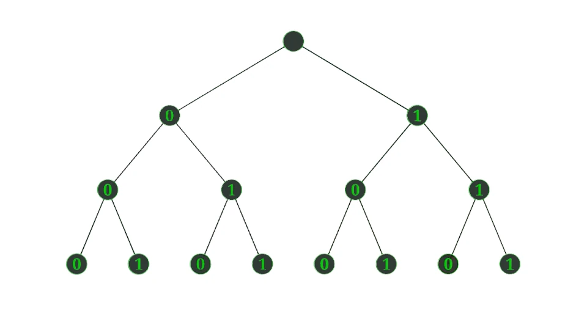


## ¿Qué es el universo?

La pregunta más fundamental del ser humano nunca ha cambiado:

"¿Qué es el universo?"

En el mundo antiguo, el I Ching (易經) respondía: El universo es cambio (變).

Golpea con los nudillos la mesa de madera que está justo frente a ti. Percibes una superficie sólida, densa y completamente real. Ahora imagina que estás explorando un videojuego de mundo abierto.

Las montañas en la pantalla se ven enormes y texturizadas, pero sabemos perfectamente que no son objetos físicos reales que podamos tocar. Debajo de esos hermosos atardeceres digitales, todo se reduce a información. Secuencias de ceros y unos interactuando entre sí a una velocidad asombrosa.

Lo que vemos como objetos físicos sólidos se comporta más bien como un software en ejecución, actualizando la posición de cada átomo constantemente. Para entender cómo funciona este mecanismo, vamos a combinar un texto de hace 3,000 años, las reglas de la física cuántica y los últimos conceptos en inteligencia artificial.

> Advertencia al lector: cuando digamos que el I Ching 'codifica' el espacio o el tiempo, no estamos afirmando que sus autores conocieran la relatividad o la informática. Estamos haciendo lo que hacen los buenos traductores: verter un lenguaje antiguo (el de los cambios y las polaridades) al lenguaje actual (el de los bits y los estados cuánticos). En este artículo exploramos cómo, a pesar de las profundas diferencias entre épocas y lenguajes, el I Ching, las matemáticas, la computación del siglo XX y la física cuántica han llegado a converger en una visión notablemente parecida.

---

## La cosmogonía del I Ching

Mucho antes de que existieran las computadoras, los antiguos eruditos en China elaboraron un texto llamado el I Ching. Ellos concluyeron que el mundo material no está hecho simplemente de cosas sólidas como planteaban Parménides y Demócrito, sino de un flujo incesante de transformaciones, como postulaba Heráclito.

Para explicar esto, comenzaron con un estado indivisible y lo separaron en dos valores opuestos, yin y yang, una elección entre dos opciones. Este diagrama muestra cómo las dos opciones iniciales se multiplican. 

Dos se convierten en cuatro, cuatro en ocho, ... y así sucesivamente hasta agotar toda la multiplicidad de cosas posibles sobre la tierra, tal como se señala en el Capítulo IX del Gran Tratado, o Ta Chuan, de las famosas  "Diez Alas" o anexos del I Ching:

> Los ocho signos forman una pequeña consumación.
> Si se continúa y se avanza y se aumentan las circunstancias mediante las transiciones hacia las otras que corresponden, se agotan con ello todas las situaciones posibles sobre la tierra.

---

## La representación del cambio (tiempo) en el I Ching

Si las líneas individuales yin o yang son bits, o digitos binarios, vamos ahora a esbozar una arquitectura de datos semántica de las distintas secuencias de n bits. Básicamente, pretendemos hacer ingeniería inversa para extraer el [código fuente o el "sistema algebraico" del I Ching](), asignándole a cada bit la función exacta que cumple dentro del algoritmo de la realidad.

Con \(n=2\) (dos líneas), tenemos los brigramas. Un bit codifica la polaridad básica (yin o yang), y el otro bit es un operador lógico de mutabilidad. En el lenguaje del I Ching, estos bigramas se conocen como las *cuatro imágenes*:

* ⚏ es el Yin Viejo o grande
* ⚎ es el Yin joven o pequeño
* ⚍ es el Yang joven o pequeño
* ⚌ es el Yang viejo o grande

Estas cuatro imágenes o bigramas son el [componente básico del I Ching en su aplicación oracular](). Las cuatro imagenes nos dan entonces el algoritmo básico del cambio. Introducen el componente temporal en nuestro sistema de representación y codifican el principio fundamental del I Ching referente a los "extremos que conducen a la reversión"- Wù jí bì fǎn (物极必反).

---

## La Representación del espacio y las fuerzas fundamentales del universo - los trigramas

Al agregar un bit y expander recursivamente el árbol binario, tenemos \(2^3=8\) estados que nos dan los 8 *trigramas*:

| ☰  Qián | ☷ Kūn  | ☳ Zhèn | ☲ Lí |
|:---:|:---:|:---:|:---:|
| ☱ Duì | ☴ Xùn | ☵ Kǎn | ☶ Gèn |

Sin embargo, al agregar este tercer bit, el I Ching da un salto semiótico monumental. Con 2 bits tenemos codificado el tiempo (las cuatro estaciones, o el ciclo de nacimiento y maduración de la polaridad). Al agregar el tercer bit, el sistema pasa a modelar el espacio y la función, creando "imágenes representativas de estados o situaciones universales reales". 

Entonces, si bien las 3 líneas de un trigrama siguen teniendo una polaridad, el significado de estas tres lineas ya no representan la polaridad per se y su mutabilidad (tiempo), sino que adquieren un significado ontológico específico llamado las "tres potencias originarias". El I Ching define el significado de la posición de cada bit así:

* Bit inferior (Línea de abajo): Representa la Tierra. Es el objeto que tiene forma, la base material y física de la situación.
* Bit central (Línea del medio): Representa al Hombre (el sujeto). Es el centro consciente que experimenta y media en la realidad.
* Bit superior (Línea de arriba): Representa al Cielo. Es el contenido, la ley espiritual o cósmica que rige la situación desde lo alto.

Según la polaridad Yin/Yang de cada potencia originaria, tenemos cualidades particulares a cada hexagrama que explican los nombres que se le da a cada uno: Cielo, Tierra, Montaña, Lago, Agua, Fuego, Madera, Trueno. Los trigramas representan procesos o energías fundamentales del Universo, según la cosmogonía del I Ching, pero no incorporan el parámetro temporal.

---

## La codificación del espacio de estados del Universo en tres niveles de resolución

Con n=6 tenemos los hexagramas de 6 líneas, que como ya sabemos, representan las 64 situaciones arquetípicas en las que el I Ching describe el estado de la realidad en un momento dado. Aquí hay tres niveles de resolución distintos y simultáneos. 

Por una parte, dividimos un hexagrama en dos trigramas, uno inferior y otro superior. El *trigrama inferior* estaría conformado por las líneas 1, 2 y 3, y el *hexagrama superior* por las líneas 4, 5 y 6. Este es el *nivel local* en el que al trigrama inferior, llamado también "signo interior", representa el mundo interno, lo subjetivo, lo doméstico o el espacio donde el individuo se prepara. El trigrama superior, o "signo exterior" representa el mundo externo, lo objetivo, lo público o la manifestación macrocósmica de la situación.

Por otra parte, podemos considerar el *nivel global* en el que se consideran las 6 líneas (bits) del hexagrama en su conjunto. El Gran Tratado explica que los sabios "juntaron estas tres energías fundamentales y las duplicaron". Al tener ahora 6 posiciones (espacios de memoria) para repartir 3 potencias, el algoritmo asigna un par de bits a cada potencia (una posición impar/Yang y una posición par/Yin).

Bajo este mapeo global a lo largo de toda la matriz de 6 bits, los dos puestos inferiores (1 y 2) constituyen el lugar de la Tierra, los dos puestos centrales (3 y 4) constituyen el lugar del Hombre, y los dos puestos superiores (5 y 6) constituyen el lugar del Cielo.

Existe aún otro nivel de resolución o representación, que llamaremos *las seis etapas del devenir*. Bajo este nivel, volvemos a incorporar el parámetro temporal del sistema y las 6 líneas pasan a representar la evolución de un estado, desde el trazo 1, donde la acción sólo comienza su despliegue (no ha empezado realmente), hasta el trazo 6, donde la acción ha llegado su término y se le contempla desde afuera.

---

## Los tres niveles de resolución en el texto del I Ching

Estos tres niveles de resolución se encuentran en los textos para cada hexagrama en el I Ching. El nivel local, por ejemplo, existe como La Imagen del hexagrama.  El tratado (Ta Chuan) dicta explícitamente que el Comentario a las Imágenes "se refiere a las imágenes de los dos semisignos (trigramas), derivando de éstas el sentido del signo integral". Es el cruce de las fuerzas naturales. Para usar una metáfora computacional, es la topología de la red: ¿Cómo se comunican el módulo interno (front-end) y el externo (back-end)?

El nivel global se corresponde al Dictamen o Juicio del hexagrama. Las Decisiones (Sentencias) que dio el rey Wen para los signos totales se refieren en cada caso a la Imagen representada de la situación total". Es la evaluación de la matriz como un todo unificado. Computacionalmente hablando, es el diagnóstico general del sistema: ¿El estado actual de la matriz es favorable o arroja un error?

Por último las seis etapas del devenir se corresponden a la sección de las líneas móviles o individuales, que nos proporcionan sentencias adicionales para alteraciones (mutaciones) en cualquiera de las etapas del proceso. Es el debugger leyendo el código línea por línea en el tiempo real. Nos dice en cuales puntos exactos del proceso temporal (del bit 1 al 6) está ocurriendo una "mutación" o modificación y nos proporcionan un código de correción (bit de paridad o error correcting code).

---

## ¿De qué está hecho el Universo?

Conviene hacer una pausa aquí. Cuando hablamos de 'código', 'bits' o 'leyes físicas', no estamos describiendo la sustancia última del universo, sino los lenguajes que hemos inventado para aproximarnos a su comportamiento. La física cuántica no es la realidad; es un modelo matemático que se sostiene mientras no sea falseado por un nuevo experimento. El I Ching no es la realidad; es un modelo simbólico que se sostiene mientras sus patrones sigan resonando con la experiencia humana. Lo que este artículo propone no es que uno de estos modelos sea 'verdadero' y el otro 'metafórico', sino que ambos, desde orillas distintas, están trazando la misma costa: un universo que se actualiza a sí mismo en cada instante.

A partir de los valores opuestos fundamentales - yin y yang - o cero y uno, para usar la terminología informática moderna, podemos crear mundos y universos enteros como en los videojuegos de hoy. Ya los autores del I Ching se nos habían adelantado en esta idea siglos antes. Entonces, ¿está el universo hecho de partículas materiales diminutas como planteaba Demócrito?

Tras muchos experimentos con colisionadores de partículas para buscar la pieza de materia más diminuta, los físicos concluyeron que no. Nunca encontraron una esfera sólida y permanente en el núcleo del universo. En su lugar, detectaron campos de energía invisibles.

Cada objeto material que percibimos con nuestros sentidos es en realidad una fluctuación temporal dentro de estos campos interactivos. Físicos teóricos como Carlo Rovelli proponen que el espacio mismo carece de una continuidad matemática lisa; es más bien una estructura intrínsecamente discreta. A escala cuántica, el tejido de la realidad se revela como un espacio de estados finitos, como lo es el conjunto de los 64 hexagramas del I Ching.

Piensa en esto como el motor gráfico de una consola de videojuegos. El mundo físico dibuja la materia visible únicamente cuando esas partículas interactúan entre sí. La física moderna nos proporciona una elaboración matemática rigurosa para las intuiciones de los textos antiguos.

---

## El Universo como un software en ejecución

El universo opera como un proceso de cálculo continuo. Si el universo es código y datos que se procesan según las leyes de la física, surge una pregunta inmediata. ¿Quién es el jugador mirando la pantalla? Esto nos lleva a inventores como Ray Kurzweil, que investigan la intersección exacta entre la biología humana y la inteligencia artificial.

Kurzweil sostiene que tu mente no es un objeto anatómico rígido. Tus recuerdos y tu personalidad forman un patrón de información que cambia constantemente. Eres, a nivel técnico, un software en ejecución.  Pero donde Kurzweil sostiene que todo es computable, incluso desde las matemáticas del siglo XX, pensadores como Gödel y Turing demostraron que en cualquier sistema lógico siempre habrá verdades que no se pueden demostrar:

* **Teorema de Incompletitud de Gödel:** En cualquier sistema lógico lo suficientemente complejo, existirán "verdades" que no pueden ser demostradas dentro de ese mismo sistema.
* **Problema de la Parada de Turing (Halting Problem):** No existe un algoritmo genérico que pueda determinar en todos los casos si un programa se detendrá o continuará ejecutándose indefinidamente.

---

## El Universo esta hecho de ... Conciencia

Una cantidad infinita de cálculos jamás podrá igualar el sentimiento de afecto humano, o el aroma del café por la mañana.  Pensadores contemporáneos como David Chalmers denominan a esta frontera el problema difícil de la conciencia. En el lenguaje del Tao Te Ching:

> El Tao que puede ser expresado con palabras
> no es el Tao eterno.
> El nombre que puede ser pronunciado
> no es el nombre eterno.

Este concepto concuerda de forma precisa con otras corrientes filosóficas de Oriente como el budismo, donde el yo nunca se define como algo rígido y estático, sino como un proceso temporal que se actualiza. 

La mecánica cuántica ortodoxa define al 'observador' como un aparato de medición. Sin embargo, existen interpretaciones heterodoxas, como la de Roger Penrose, que proponen que la conciencia podría estar vinculada a los procesos de colapso de la función de onda. Aunque esta teoría (Orch-OR) no tiene consenso experimental y es criticada por problemas como la decoherencia, su mera existencia muestra que la frontera entre la física y la filosofía de la mente sigue abierta.

Manteniendo esta apertura de perspectiva, podríamos afirmar que el ser humano no es un espectador pasivo ubicado fuera del universo observándolo a la distancia. Su mente es parte de ese mismo código. Es el universo procesándose a sí mismo.

La realidad opera entonces en dos capas simultáneas. El universo genera billones de datos por segundo, pero es la conciencia la que le otorga significado. Y tú, que estás leyendo esto, eres la chispa que convierte los cálculos en una realidad viva.

---

### Complementa la lectura con el video:

Si prefieres profundizar en estos conceptos de forma visual y escuchar el análisis detallado, te invito a ver el siguiente video en mi canal:

