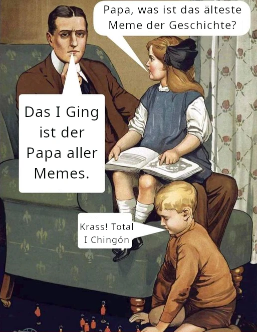

Viele Menschen glauben, dass der Begriff „Meme“ mit der Internetkultur geboren wurde und sich auf jene lustigen Bilder, Sticker oder Animationen bezieht, die die Leute ständig in den sozialen Netzwerken teilen. Ich meine Bilder wie dieses:

Oder seine I-Chingón-Version:



Vielleicht ist die Erklärung überflüssig, aber zum Wohle derer, die die letzten zwanzig Jahre unter einem Stein gelebt haben oder mit diesem speziellen Meme nicht vertraut sind, erkläre ich es: Dieses Bild ist die Vorlage für das Meme des abgelenkten Freundes, das einen jungen Mann zeigt, der die Hand seiner Freundin hält und fasziniert zu einer anderen Frau in Rot blickt, die an ihm vorbeigeht.

---

## Internet-Memes

Dieses Bild wurde verwendet, um unzählige Metaphern zu vermitteln, indem man jedem der drei Charaktere ein Etikett zuweist. Zum Beispiel könnten wir die Frau in Rot als „Kapitalismus“ und die verärgerte Freundin als „Sozialismus“ bezeichnen (oder umgekehrt). Oder um ein weniger kontroverses Beispiel zu nennen: Wir könnten sagen, dass die Frau in Rot das 3000 Jahre alte I Ging repräsentiert, während die verärgerte Freundin die weniger als ein Jahrzehnt alten KI-Chatbots darstellt.

Eine der interessantesten Eigenschaften von Memes ist ihre semantische Flexibilität, um jede beliebige Metapher auf prägnante und intuitiv leicht verständliche Weise zu kommunizieren. Selbst in diesem Sinne, wie wir den Meme-Begriff populär verstehen, müssten wir schlussfolgern, dass das I Ging eine Sammlung von Memes ist - 64 Memes, um genau zu sein.

Jedes der 64 Hexagramme ist ein Archetyp, der eine universelle Situation repräsentiert. Zum Beispiel steht das Hexagramm [23]({}), genannt „Die Auflösung“, für Situationen, in denen alles um uns herum zusammenzubrechen scheint. Die visuelle Metapher ist die einer Struktur, die von der Basis her zerfällt, und sie entspricht dem Gefühl der Ohnmacht angesichts übermächtiger Kräfte, wie ich in diesem Video erkläre:



Tatsächlich besitzt das I Ging aufgrund der Tatsache, dass jedes Hexagramm eine archetypische Universalsituation darstellt, eine außergewöhnliche semantische Flexibilität, und daher ist es als Orakel so vielseitig anwendbar. In diesem Sinne müssten wir die Frage im Titel mit Ja beantworten: Mit seinen über 3000 Jahren ist das I Ging vielleicht die älteste Meme-Sammlung der Geschichte. Aber es gibt noch mehr ...

---

## Richard Dawkins und „Das egoistische Gen“

1976 definierte der Biologe Richard Dawkins den Begriff „Meme“ als eine Idee, die sich in der menschlichen Kultur repliziert und überlebt. In seinem Buch „Das egoistische Gen“ (The Selfish Gene), das 1976 veröffentlicht wurde, wird das Meme als etwas Analoges zum Gen, jedoch im kulturellen Raum, definiert. Die These dieses Buches ist, dass, so wie die Gene, die Einheiten der genetischen Übertragung, die Individuen einer Art nutzen, um sich im Genpool zu verewigen und zu konkurrieren, die Memes die Gehirne der Individuen nutzen, um sich als Einheiten der kulturellen Übertragung zu verewigen und mit anderen kulturellen Einheiten zu konkurrieren (oder zu kooperieren).

Dawkins wählte das Wort Meme aufgrund seiner etymologischen Wurzel - es leitet sich vom griechischen Wort mimema („etwas Nachgeahmtes“) ab, weil Memes zunächst durch Nachahmung zwischen Menschen übertragen wurden, so wie ein Baby das Sprechen lernt, indem es seine Eltern nachahmt. Sprachen, Religionen, Ideen, Melodien, Moden, Redewendungen und sogar Internet-Memes - all das sind Memes und werden letztlich durch Nachahmung übertragen. Man beachte, dass sogar der Begriff „Viralität“ im Internet diese Wurzel des Memes als Metapher für die genetische Übertragung (Viren) verrät.

Und so wie Gene bei der Weitergabe von Individuum zu Individuum mutieren und sich anpassen, tun dies auch Memes. Lange vor den populären Internet-Memes tat das I Ging genau das: Es mutierte[^1], passte sich an und überlebte über 3000 Jahre, um Weisheit zu vermitteln. Zuerst war es der mythische König Fu Xi, der die Zeichen der Trigramme auf dem Panzer einer Schildkröte entdeckte; dann fügten im Laufe der Jahrhunderte Konfuzius und seine Schüler ihre Kommentare hinzu zu dem, was zuvor ein [Buch ohne Worte]() war, und schließlich wurde es im Westen durch Gelehrte wie Richard Wilhelm dank seiner berühmten Übersetzung des I Ging bekannt.

Wenn also das I Ging auch nicht das älteste Meme der Geschichte ist - wenn wir es zusammen mit der Entdeckung des Feuers, der Sprache und der Feuersteinwerkzeuge betrachten - so ist das Buch der Wandlungen dennoch sicherlich viel älter als die Internet-Memes.

---

### Ergänze die Lektüre mit dem Video:

Wenn du diese Konzepte lieber visuell vertiefen und die detaillierte Analyse anhören möchtest, lade ich dich ein, die vollständige Lektion auf meinem Kanal anzusehen:



[^1]: Wie könnte etwas, das sich Das Buch der Wandlungen nennt, nicht selbst wandeln? 😉