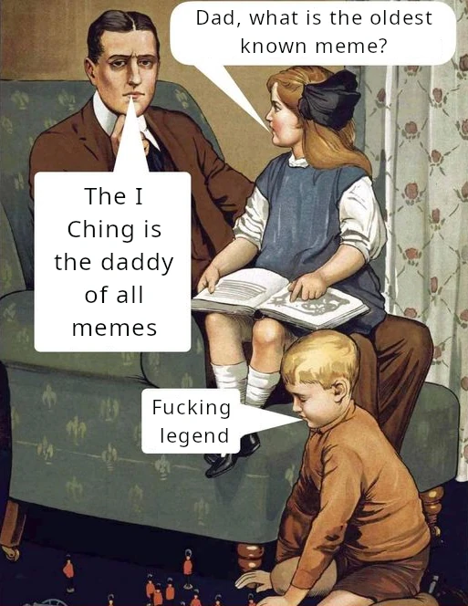

Many people believe the term 'meme' was born with internet culture, referring to those humorous images, stickers, or animations that people constantly share on social media. I mean images like this:

Or its I Chingón version:



The explanation may be superfluous, but for the benefit of those who have lived under a rock for the last two decades or are unfamiliar with that particular meme, let me explain: this image is the template for the distracted boyfriend meme, showing a young man holding hands with his girlfriend while gazing fascinated at another woman, dressed in red, walking past them.

---

## Internet Memes

This image has been used to convey countless metaphors by labelling each of the three characters. For example, we could label the woman in red as "capitalism" and the upset girlfriend as "socialism" (or vice versa). Or, to use a less controversial example, we could say that the woman in red (now Dailingna) represents the 3,000‑year‑old I Ching, while the upset girlfriend represents AI chatbots that are less than a decade old.

One of the most interesting characteristics of memes is their semantic flexibility to communicate any metaphor in a concise and intuitively understandable way for anyone. Even in this sense - the popular understanding of the concept of a meme - we would have to conclude that the I Ching is a collection of memes: 64 memes to be exact.

Each of the 64 hexagrams is an archetype representing a universal situation. For example, Hexagram 23, called "Disintegration" (or "Splitting Apart"), represents situations where everything seems to collapse around us. The visual metaphor is that of a structure crumbling from its base, resonating with the feeling of helplessness before greater forces, as I explain in this video:



In fact, because each hexagram represents a universal archetypal situation, the I Ching has extraordinary semantic flexibility and that is why it has so much applicability as an oracle. In that sense, we would have to answer the title question affirmatively: with its more than 3,000 years of age, the I Ching is perhaps the oldest collection of memes in history. But there is more...

---

## Richard Dawkins and "The Selfish Gene"

In 1976, biologist Richard Dawkins defined 'meme' as an idea that replicates and survives in human culture. In his book *The Selfish Gene*, published in 1976, the meme is defined as something analogous to the gene, but in the cultural space. The thesis of this book is that, just as genes - units of genetic transmission - use individuals of a species to perpetuate themselves and compete in the gene pool, memes use individual brains to perpetuate themselves as units of cultural transmission and compete (or cooperate) with other cultural units.

Dawkins chose the word meme because of its etymological root - it derives from the Greek word *mimema* ("something imitated") - because memes were first transmitted through imitation among human beings, just as a baby learns to speak by imitating its parents. Languages, religions, ideas, melodies, fashions, phrases, and even internet memes - all are memes and ultimately are transmitted by imitation. Notice that even the term *virality* on the Internet betrays this root of the meme as a metaphor for genetic transmission (viruses).

And just as genes mutate and adapt as they are transmitted from individual to individual, memes do too. Long before popular internet memes, the I Ching was already doing exactly that: mutating, changing[^1], adapting, and surviving for over 3,000 years to offer wisdom. First, the legendary King Fu Xi discovered the signs of the trigrams on a turtle shell; then, over the centuries, Confucius and his disciples added their commentaries to what was previously a [wordless book](); and eventually it was introduced to the West by scholars such as Richard Wilhelm, thanks to his famous translation of the I Ching.

So, while the I Ching is not the oldest meme in history - if we consider the discovery of fire, language, and flint tools - the Book of Changes is certainly much older than internet memes.

---

### Complement your reading with the video:

If you prefer to delve deeper into these concepts visually and hear the detailed analysis, I invite you to watch the full lesson on my channel:



[^1]: How could something called *The Book of Changes* not change? 😉