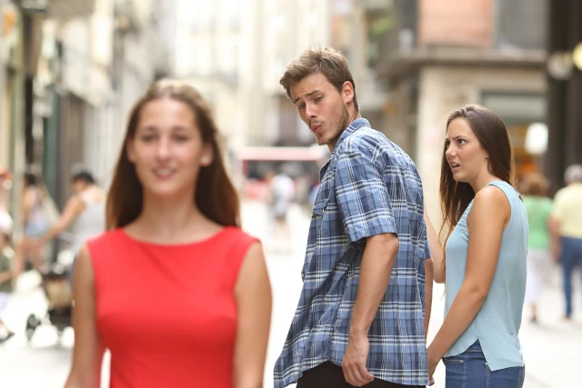
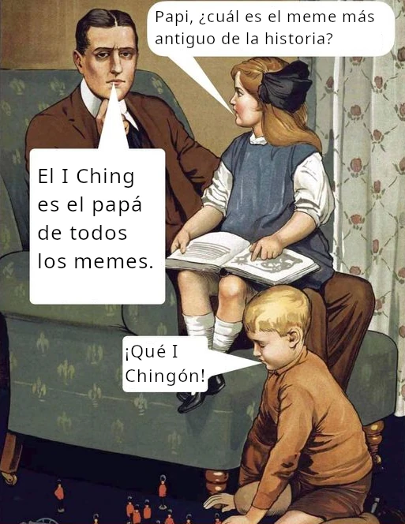

Muchas personas creen que el término 'meme' nació con la cultura del Internet, y se refiere a esas imágenes, stickers o animaciones jocosas que la gente cada rato comparte en las redes sociales. Me refiero a imágenes como esta:

O su versión I Chingón:

Quizás huelga la explicación, pero para beneficio de los que han vivido debajo de una roca las últimas dos decadas o no están familiarizados con ese meme en particular, les explico: esta imagen es la plantilla del meme del novio distraido, que muestra a un joven agarrado de la mano de su novia mirando fascinado a otra mujer, vestida de rojo, que pasa a su lado. 

---

## Los memes de Internet

Esta imagen se ha usado para comunicar una infinidad de metáforas asignandole una etiqueta a cada uno de los tres personajes. Por ejemplo, podriamos etiquetar a la mujer de rojo como "capitalismo" y a la novia molesta como "socialismo" (o vice versa). O para usar otro ejemplo menos polémico, podriamos decir que la mujer de rojo (ahora Dailingna) representa el I Ching con 3000 años de antigüedad, mientras que la novia molesta representa a los chatbots de IA que tienen menos de una década.

Una de las características mas interesantes de los memes es su flexibilidad semántica para comunicar cualquier metafora, de una forma concisa e intuitivamente fácil de entender para cualquiera. Incluso en este sentido, en el que entendemos popularmente el concepto de meme, tendríamos que concluir que el I Ching es una colección de memes- 64 memes para ser exactos.

Cada uno de los 64 hexagramas es un arquetipo que representa una situación universal. Por ejemplo, el Hexagrama 23, llamado "La Desintegración" representa situaciones en las que todo parece derrumbarse a nuestro alrededor. La metáfora visual es la de una estructura que se desmorona desde la base y resuena con la sensación de impotencia ante fuerzas mayores, tal como lo explico en este video:



De hecho, debido a que cada hexagrama representa una situación arquetípica universal, el I Ching tiene una flexibilidad semántica extraordinaria y por eso tiene tanta aplicabilidad como oráculo. En ese sentido, tendriamos que responder la pregunta del título afirmativamente: con sus más de 3000 años de antigüedad, el I Ching es quizás la colección de memes más antiguos de la historia. Pero hay más...

---

## Richard Dawkins y "El gen egoísta" 

En 1976, el biologo Richard Dawkins definió 'meme' como una idea que se replica y sobrevive en la cultura humana. En su libro "El gen egoísta" (The Selfish Gene), publicado en 1976, el meme se define como algo análogo al gen, pero en el espacio cultural. La tesis de este libro es que, asi como los genes, que son unidades de transmisión genética, utilizan a los individuos de una especie para perpetuarse y competir en el pool genético, los memes utilizan a los cerebros de los individuos para perpetuarse como unidades de transmisión cultural y competir (o cooperar) con otras unidades culturales.

Dawkins escogío la palabra meme debido a su raíz etimológica- deriva de la palabra griega mimema ("algo imitado"), porque los memes primero se transmitian por imitación entre los seres humanos, así como un bebé aprende hablar imitando a sus padres. Las lenguas, religiones, ideas, melodías, modas, frases e incluso los memes de internet- todos son memes y ultimadamente se transmiten por imitación. Fíjense que hasta el término *viralidad* en Internet delata esta raíz del meme como metafora de la transmisión genética (los virus).

Y asi como los genes mutan y se adaptan al ser transmitidos de individuo a individuo, los memes también. Mucho antes de los memes populares de internet, el I Ching ya estaba haciendo exactamente eso: mutando[^1], adaptándose y sobreviviendo por más de 3000 años para dar sabiduría. Primero, fue el mítico Rey Fu Xi quien descubrió los signos de los trigramas en el caparazón de una tortuga, luego a través de los siglos, Confucio y sus discípulos les agregaron sus comentarios a lo que antes fue un [libro sin palabras]() y eventualmente fue dado a conocer en Occidente por estudiosos como Richard Wilhelm, gracias a su famosa traducción del I Ching.

Así que, si bien el I Ching no es el meme más antiguo de la historia, si lo consideramos junto al descubrimiento del fuego, el lenguaje y las herramientas de sílex, el libro de las mutaciones es ciertamente mucho más antiguo que los memes de Internet.

---

### Complementa la lectura con el video:

Si prefieres profundizar en estos conceptos de forma visual y escuchar el análisis detallado, te invito a ver la lección completa en mi canal:



[^1]: ¿Cómo podría no mutar algo que se llama *El Libro de las Mutaciones*? 😉