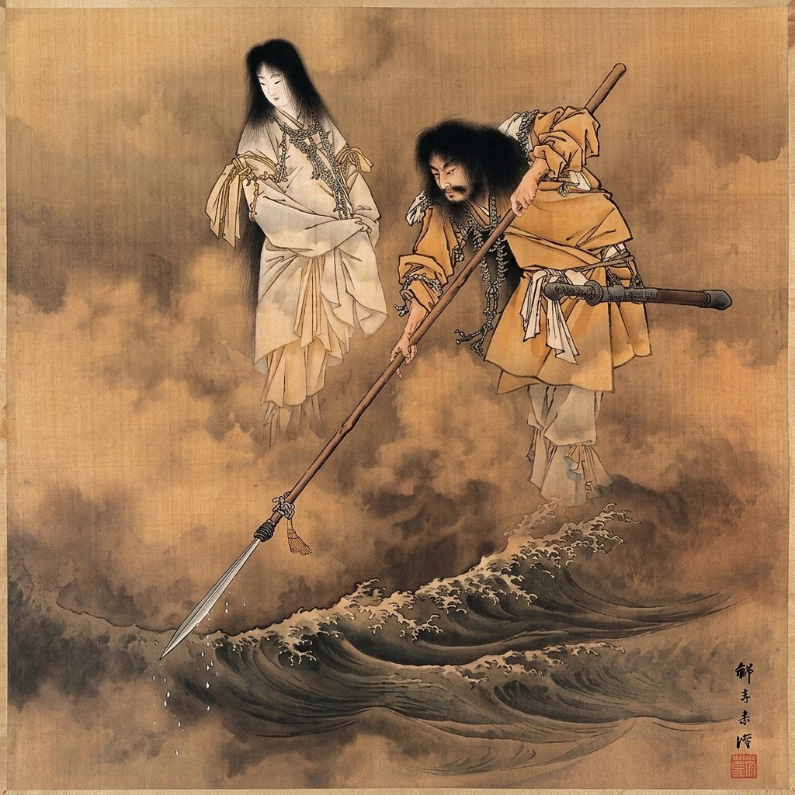

La conexión entre el I Ching (o Yijing) y el mito de la creación japonesa del Kojiki es un fascinante ejemplo de cómo el pensamiento chino influyó en la construcción de la cosmogonía japonesa. De hecho, el Kojiki es el libro histórico más antiguo que se conoce sobre la historía del Japón. Por otro lado, el origen del I Ching se pierde en la neblina del tiempo. Además, los autores del Kojiki tomaron prestados conceptos y términos del mismo I Ching.

La prueba más directa y fehaciente de esto se encuentra en el propio prefacio del Kojiki, que describe el inicio del mundo utilizando expresiones de clara raíz china. El prefacio menciona el proceso como `kenkon shobun` (乾坤初分), que significa "la separación inicial de yang y yin". Aquí, "Ken" (乾) y "Kon" (坤) son las lecturas japonesas de los dos primeros hexagramas del I Ching: Qián (乾), que representa el Cielo, lo Creativo, la energía Yang pura; y Kūn (坤), que representa la Tierra, lo Receptivo, la energía Yin.

El prefacio también usa la expresión `tenchi kaibyaku` (天地開闢), que significa "la apertura de Cielo y Tierra". Esta idea de una división primordial que da origen al orden es el corazón del Hexagrama 1 (Qián) del I Ching.

Esto demuestra que los compiladores del mito no solo conocían el I Ching, sino que usaron su vocabulario central para describir el acto mismo de la creación. La "separación inicial de yang y yin" es el principio cosmogónico fundamental tanto para el I Ching como para la visión del mundo que los autores del Kojiki quisieron proyectar.

Más aún, tanto el I Ching como el mito del Kojiki parten de un estado de caos o vacuidad indiferenciada. La creación, en ambas tradiciones, no es un acto de creación ex nihilo (de la nada), sino un proceso de diferenciación y separación. El I Ching explica que del Taiji (el Supremo Último) surgen el Yin y el Yang. De la interacción de estas dos fuerzas primordiales, nace todo lo demás. El prefacio del Kojiki refleja esta misma lógica al describir el comienzo como la separación de Cielo y Tierra, una idea que resuena directamente con el [Hexagrama 1]({}) (Qián/Cielo) y el [Hexagrama 2]({}) (Kun/Tierra).

Estudios académicos nos indican que la construcción del mito de la creación japonés, especialmente en el Nihon Shoki (otra crónica oficial), estuvo fuertemente influenciada por conceptos relacionados con el I Ching, como el Taiji (Supremo Último), el Yin/Yang (las dos fuerzas complementarias), el Qiankun (Cielo y Tierra), el Sancai (tres poderes: Cielo, Tierra y Hombre) y el Bagua (ocho trigramas). Los eruditos de la corte japonesa del período Nara (710-794 d.C.) estaban muy familiarizados con la filosofía china y la usaron como un marco intelectual para estructurar y dar sentido a sus propias tradiciones.

En este Youtube Short 



he intentado plasmar la esencia símbolica del Hexagrama 1 y su relación con el mito de la creación japonesa en el Kojiki. La imagen está inspirada en una pintura que muestra a las deidades japonesas Izanagi e Izanami, padres de Amaterasu, creando el archipielago japonés. 

Es una representación animada del propio texto canónico del Hexagrama 1:

> Grande en verdad es la Elevación de lo Creativo,
> a la cual todas las cosas deben su comienzo
> y la que penetra todo el Cielo.
>
> Las nubes pasan, y la lluvia actúa,
> y todos los seres individuales fluyen introduciéndose en su forma.
>
> Al poseer el hombre santo gran claridad sobre fin y comienzo
> y sobre el modo en que los seis peldaños se consuman
> y se tornan cabales cada cual a su tiempo,
> viaja sobre ellos como sobre seis dragones hacia el Cielo.

En cuanto a la estética, esta basada en pinturas surrealistas de artistas como Salvador Dali y René Magritte. Considero que el surrealismo es la forma más idónea de representar conceptos que lleguen directo al subconsciente, allí donde opera un oráculo como el I Ching.

Musicalmente, también me inspiré en el album homonimo de Kitaro: Kojiki 



