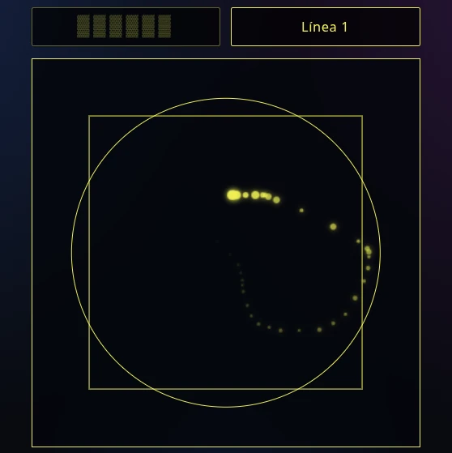

**Zusammenfassung.** Wir schlagen ein dezentrales, nicht-deterministisches Entscheidungsfindungsrahmenwerk vor – das Constrained Stochastic Hermeneutical Computing (CSHC) –, das die inhärente Schmeichelei kommerzieller Large Language Models (LLMs) und die deterministischen Grenzen der pseudozufälligen Zahlengenerierung auflöst. Durch die Nutzung der Kinästhetischen Entropieerfassung (KEC) zur Nutzbarmachung physischer menschlicher Bewegung etabliert das System einen Filter auf Hardware-Ebene gegen kognitive Verzerrung und Ego-Projektion. Diese rohe Entropie wird durch eine endliche Zustands-Raisonniermaschine auf Basis des I Ging verarbeitet, die die Daten auf einen 4096-Zustands-semantischen Vektorraum abbildet, um strukturelle Kausalität zu berechnen. Schließlich fungiert ein am Edge berechnetes, streng eingeschränktes LLM als neutraler hermeneutischer Übersetzer, der die algorithmische Ausgabe mit dem Kontext des Nutzers verbindet. Das Ergebnis ist ein mathematisch rigoroses, datenschutzorientiertes Protokoll, das physisches Chaos in umsetzbare Erkenntnisse verwandelt – ohne zentralisierte Datenextraktion oder KI-Huldigung.

---

## Die Rasonniermaschine: Überblick über das I Ging als Wahrsagewerkzeug

Das I Ging ist sowohl ein Wahrsagewerkzeug als auch ein Weisheitsbuch, das Jahrtausende zurückreicht. Wie alle Orakel basiert es auf einem Zufallsexperiment (Gruppieren von Schafgarbenstängeln oder sechsmaliges Werfen von drei Münzen), um ein Hexagramm zu erhalten – ein Symbol aus 6 Linien, die entweder Yin oder Yang sein können, oder Yin, das zu Yang mutiert, oder Yang, das zu Yin mutiert. Insgesamt gibt es 64 mögliche Hexagramme (2⁶). Jedes Hexagramm entspricht einem Archetyp oder Symbol, das die Frage des Ratsuchenden an das Orakel auf sinnvolle Weise „abbildet".

Darüber hinaus kann jede gegebene Linie eine mutierende Yin- oder Yang-Linie sein, und mutierende Linien, falls vorhanden, zeigen auch an, dass sich die gegenwärtige Situation, nach der der Suchende fragt, entwickelt, wie sie sich entwickelt und welcher Rat gegeben wird, um die Situation erfolgreich zu navigieren. Bei beweglichen Linien entwickelt sich das geworfene Hexagramm zu einem sekundären Hexagramm, das uns einen Hinweis auf die wahrscheinliche Zukunft gibt, in die sich die Situation entwickelt, wenn wir dem Rat der beweglichen Linien folgen würden, oder umgekehrt auf die Zukunft, die wir vermeiden würden, indem wir gemäß dem Rat des Orakels handeln.

### Hexagrammwerfungen als Elemente eines semantischen Raums

Das I Ging konstruiert seine tiefgründige Weisheit aus einer bemerkenswert einfachen binären Grundlage von Yang und Yin, die den Basiscode für eine weitaus komplexere semantische Architektur bilden. Diese Struktur ist rechnerisch elegant; jede rituelle Werfung wählt einen Punkt aus einem diskreten Vektorraum von 4096 eindeutigen Zuständen (4⁶) aus, wobei stabile und transformierende Linien berücksichtigt werden. Diese Zahl ist entscheidend: Sie bietet ein sparsames, aber ausreichend umfangreiches Modell, um die unzähligen Situationen menschlicher Erfahrung abzubilden, und bietet immensen Erklärungswert bei gleichzeitiger Beibehaltung einer handhabbaren Interpretation.

Diese Handhabbarkeit entsteht aus der geschichteten Grammatik des Systems, bei der die Bedeutung auf jeder Ebene begrenzt und kontextualisiert wird. Die spezifische Bedeutung einer Linie schwebt nicht frei, sondern wird durch ihre Position – von der grundlegenden ersten Linie bis zur krönenden sechsten – und durch das Trigramm, zu dessen Bildung sie beiträgt, geformt, wodurch ein Kernbestand von Interpretationen adaptiv auf verschiedene Kontexte angewendet werden kann. Diese präzise, regelbasierte Struktur ist es, die eine konsistente Navigation ihrer symbolischen Tiefe ermöglicht.

Die 64 Hexagramme repräsentieren (ambivalent) verschiedene Prozesse im Universum in verschiedenen Kontextschichten, und die Anwesenheit beweglicher Linien in einem geworfenen Hexagramm liefert spezifische Aufmerksamkeitspunkte innerhalb dieses Prozesses. Bei beweglichen Linien erhält der Ratsuchende ein „zukunfts"- oder abgeleitetes Hexagramm, das nicht als Wahrsagung oder Blick in die Zukunft interpretiert werden sollte, sondern als strukturelle Konsequenz jenes besonderen Prozesses, der durch das geworfene Hexagramm und seine Veränderungsdynamik angezeigt wird. Dies ist bemerkenswert – das I Ging sagt die Zukunft nicht im wahrsagerischen oder mystischen Sinne voraus, sondern in derselben Weise, wie wissenschaftliche Theorien die Zukunft vorhersagen – als das wahrscheinlichste Ergebnis des Systemzustands und der Strukturgleichungen des dynamischen Modells.

Die semantische Tiefe einer I-Ging-Konsultation wird weiter durch die inhärenten Transformationsdimensionen des Hexagramms erschlossen. Der Kern jeder Situation wird durch seine nuklearen Trigramme offenbart, die aus den inneren Linien gebildet werden und die verborgene Dynamik im Herzen des geworfenen Symbols freilegen. Darüber hinaus – und dieser Punkt ist für meine Konsultations-App relevant – kann man durch Bezugnahme auf die vorhimmlische Sequenz, die uralte Anordnung der Hexagramme, die die Ordnung der kosmischen Prinzipien abbildet, das geworfene Hexagramm bis zu seiner vorausgehenden „Gedankenwelt" zurückverfolgen. Dies offenbart die grundlegenden Bedingungen und Kausalitätsmuster, die den gegenwärtigen Moment hervorbrachten, und bietet beispiellose Einsicht in seine Genese.

Kurz gesagt, das I Ging funktioniert als ein hochentwickelter ontologischer Computer. Seine 64-Archetypen-Matrix, erweitert durch Veränderungsregeln und relationale Schichten, bildet einen vollständigen Zustandsraum zur Modellierung der Realität. Indem man seine Koordinaten innerhalb dieses 4096-Zustands-Feldes identifiziert und die durch seine nuklearen und vorausgehenden Hexagramme offenbarten Trajektorien analysiert, bietet es einen präzisen Algorithmus zur Harmonisierung des Handelns mit den fundamentalen Mustern des Universums. Diese präzise, berechenbare Grammatik der Veränderung, die sowohl den gegenwärtigen Zustand als auch sein kausales Substrat erklärt, macht es zu einem außergewöhnlich wirkungsvollen Rahmenwerk zur Steuerung komplexer Entscheidungsfindung und ist der Grund, warum das I Ging im Kern der Rasonniermaschine unserer App steht.

---

## Die Synchronizitätsmaschine: Kinästhetische Entropieerfassung (KEC)

Die KEC stellt sicher, dass der Nutzer an der Erlangung des resultierenden Hexagramms teilnimmt und dass der Zufall die Bewegungen oder Gesten des Nutzers einbezieht, was ein exaktes Spiegelbild des physischen Münzwurfs ist: Was wir als Energie oder Schwingung des Ratsuchenden bezeichnen, in seinem Unterbewusstsein enthalten, aber völlig ignoriert oder der Welt nicht explizit gemacht, reist durch seine Gesten und Bewegungen.

Die KEC fungiert als erste Verteidigungslinie gegen das Ego und seine eigenen Gespenster oder Projektionen, was an eine alte Zen-Geschichte erinnert:

> **Der Geist**
>
> Die Frau eines Mannes wurde sehr krank. Auf ihrem Sterbebett sagte sie zu ihm: „Ich liebe dich so sehr! Ich will dich nicht verlassen, und ich will nicht, dass du mich verrätst. Versprich mir, dass du keine anderen Frauen sehen wirst, wenn ich sterbe, oder ich werde zurückkommen, um dich heimzusuchen." Mehrere Monate nach ihrem Tod mied der Ehemann andere Frauen, doch dann traf er jemanden und verliebte sich. In der Nacht, in der sie sich verlobten, erschien ihm der Geist seiner verstorbenen Frau. Sie beschuldigte ihn, das Versprechen nicht gehalten zu haben, und jede Nacht danach kehrte sie zurück, um ihn zu verspotten. Der Geist erinnerte ihn an alles, was sich zwischen ihm und seiner Verlobten an jenem Tag zugetragen hatte, bis hin dazu, ihre Gespräche Wort für Wort zu wiederholen. Das beunruhigte ihn so sehr, dass er überhaupt nicht schlafen konnte. Verzweifelt suchte er den Rat eines Zen-Meisters, der in der Nähe des Dorfes lebte.
>
> „Das ist ein sehr kluger Geist", sagte der Meister, als er die Geschichte des Mannes hörte. „Das ist er!" antwortete der Mann. „Sie erinnert sich an jedes Detail von dem, was ich sage und tue. Sie weiß alles!" Der Meister lächelte: „Du solltest einen solchen Geist bewundern, aber ich werde dir sagen, was du tun sollst, wenn du ihn das nächste Mal siehst." In jener Nacht kehrte der Geist zurück. Der Mann antwortete genau so, wie der Meister es ihm geraten hatte. „Du bist ein so weiser Geist", sagte der Mann. „Du weißt, dass ich nichts vor dir verbergen kann. Wenn du mir eine Frage beantworten kannst, werde ich die Verlobung lösen und für den Rest meines Lebens ledig bleiben." „Stell deine Frage", erwiderte der Geist. Der Mann schöpfte eine Handvoll Bohnen aus einem großen Sack auf dem Boden: „Sag mir genau, wie viele Bohnen in meiner Hand sind."
>
> In diesem Moment verschwand der Geist und kehrte nie wieder zurück.

Deshalb beziehen die meisten Orakel, unabhängig von der Tradition, den Zufall ein: weil das, was außerhalb des Kontextfensters des Egos liegt, nicht verstärkt oder auf die Antwort projiziert werden kann. Deshalb verwenden wir eine kinästhetische Entropieerfassung.

### Operative Definition der KEC

Technisch funktioniert dies wie folgt: Dem Nutzer wird eine minimalistische Benutzeroberfläche präsentiert, die eine Leinwand mit einem Quadrat und einem darin eingeschriebenen Kreis enthält (die Quadratur des Kreises). Diese Figur ist nicht dekorativ: Sie verdichtet die Spannung zwischen dem Deterministischen und dem Transzendentalen, die sich durch die gesamte Konsultation zieht und deren symbolische und philosophische Grundlage wir am Ende dieses Abschnitts entwickeln.



Auf dieser Leinwand zieht der Nutzer mit dem Mauszeiger oder dem Finger auf dem Touchscreen seines Geräts Striche und erfasst dabei Tupel (x, y, t), die Punkten auf der Leinwand und dem Moment ihrer Erzeugung entsprechen.

### Der Hash-Algorithmus und die transzendentale Natur der Konsultation

Die KEC erfasst nicht bloß die Bewegung des Nutzers: Sie transformiert sie zusammen mit der Entropie des Moments und der Umgebung in einen diskreten Wert, der einer Linie des Hexagramms entspricht. Diese Transformation wird mithilfe eines nicht-kryptografischen Hash-Algorithmus, FNV-1a mit 32 Bit, durchgeführt, dessen Wahl nicht willkürlich ist: Sie spiegelt auf technischer Ebene dieselbe Unmöglichkeit deterministischer Reduktion wider, die die Quadratur des Kreises auf geometrischer Ebene darstellt.

#### Der FNV-1a-Algorithmus

FNV-1a (Fowler–Noll–Vo, Variante 1a) ist eine Hash-Funktion, die durch folgende Rekurrenz definiert ist:

```
h₀ = offset_basis
für jedes Zeichen c in der Eingabe:
hᵢ₊₁ = (hᵢ XOR c) × prim (mod 2³²)
```

Für 32 Bit sind die Standardkonstanten:

| Konstante | Hexadezimalwert | Dezimalwert |
|----------|-------------------|---------------|
| Offset-Basis | `0x811c9dc5` | 2.166.136.261 |
| FNV-Primzahl | `0x01000193` | 16.777.619 |

Die Offset-Basis ist ein von Null verschiedener Anfangswert, der in seinem Ursprung fast anekdotisch gewählt wurde (eine falsch kopierte E-Mail-Signatur), dessen Funktion jedoch darin besteht, sicherzustellen, dass die leere Eingabe keinen trivialen Hash erzeugt. Die FNV-Primzahl hingegen wurde nach präzisen mathematischen Kriterien ausgewählt: Sie muss wenige auf 1 gesetzte Bits haben (genau sechs in ihrer Binärdarstellung), eine spezifische Form \(2^{24} + 2^8 + 0x93\) aufweisen und modulare Eigenschaften besitzen, die die Bitstreuung maximieren. Diese Kriterien stellen sicher, dass die Multiplikation die Entropie nicht in einer reduzierten Teilmenge von Bits konzentriert, sondern sie gleichmäßig über die 32 Bits des Akkumulators verteilt.

Im Code ist die Implementierung direkt:

```js
let h = 0x811c9dc5;
for (let i = 0; i < rawData.length; i++) {
  h ^= rawData.charCodeAt(i);
  h = Math.imul(h, 0x01000193);
}
```

`Math.imul` garantiert 32-Bit-Arithmetik mit kontrolliertem Überlauf und vermeidet den Präzisionsverlust, der mit dem `*`-Operator von JavaScript bei Produkten auftreten würde, die \(2^{53}\) überschreiten. Das Endergebnis ist eine vorzeichenlose 32-Bit-Ganzzahl, die anschließend durch eine zusätzliche Mischung mit `Math.random()` auf einen Float in \([0,1)\) normalisiert wird.

### Der Lawineneffekt: Nichtlinearität bei minimalen Variationen

Die grundlegende Anforderung der KEC ist, dass eine minimale Variation in der Bewegung des Nutzers – ein Unterschied von einem Pixel in `x`, ein Unterschied von einer Millisekunde in `t` – einen qualitativ unterschiedlichen Hash erzeugt, keine proportionale Variation. Dies ist der Lawineneffekt, formalisiert von Shannon: Eine Änderung eines Bits in der Eingabe sollte im Durchschnitt die Hälfte der Bits der Ausgabe ändern.

Betrachten wir zwei Pools, die sich in einem einzigen Tupel unterscheiden, in einem einzigen Pixel:

```Pool A: 123,45,1023;124,46,1031;...
Pool B: 123,45,1023;125,46,1031;...
```

Die serialisierte Zeichenkette unterscheidet sich in einem einzigen Zeichen: `'4'` → `'5'`. In der FNV-1a-Schleife ist der Akkumulator `h` bis zur Position des geänderten Zeichens in beiden Fällen identisch. An dieser Position erzeugt das XOR eine Differenz von einem Bit. Die Multiplikation mit der Primzahl verstärkt diese Differenz: Eine Änderung von 1 in `h` erzeugt eine Änderung von ungefähr `p` im Produkt, die sich modulo \(2^{32}\) über viele Bits ausbreitet. Die nachfolgenden Iterationen verstärken die Divergenz weiter, da jedes XOR und jede Multiplikation auf bereits unterschiedlichen Zuständen operieren. Nach wenigen Iterationen sind die beiden Hashes völlig verschieden, ohne erkennbare Beziehung.

Die Nichtlinearität stammt aus zwei Quellen. Erstens ist das XOR bitweise linear über GF(2), aber die Multiplikation führt Überträge ein, die nichtlineare Operationen auf den Bits sind. Die Kombination XOR → Multiplikation bricht jede Linearität, die das XOR gehabt haben könnte. Zweitens spielt die Position der Änderung eine Rolle: Eine Änderung im Zeichen `i` beeinflusst `hᵢ`, das dann `(n - i)` weitere Iterationen durchläuft. Je früher die Änderung erfolgt, desto mehr Iterationen verstärken sie; je später, desto weniger. Aber selbst eine Änderung im letzten Zeichen erzeugt eine signifikante Differenz, weil das abschließende XOR `h` vor der letzten Multiplikation verändert.

FNV-1a ist nicht kryptografisch: Seine Lawine ist in der Praxis gut, aber nicht optimal. Die hohen Bits sind weniger durchmischt, und für die 32-Bit-Version sind Kollisionen bekannt. Für den Zweck des I Ging sind diese Einschränkungen irrelevant: Weder Kollisionsresistenz noch kryptografische Gleichmäßigkeit sind erforderlich. Was erforderlich ist, ist, dass minimale Variationen unterschiedliche Ergebnisse erzeugen, und das wird mit Leichtigkeit erfüllt. Die Abweichung von den idealen 50 % ist gering und beeinträchtigt die praktische Nutzung nicht.

### Die Konjunktion der Entropien: kinästhetisch, temporal und umgebungsbedingt

Die Zeichenkette, die gehasht wird, kombiniert drei Quellen:

| Quelle | Ursprung | Natur | Typische Länge |
|--------|--------|--------|----------------|
| Tupel `(x, y, t)` | Bewegung des Nutzers | Kinästhetisch | Hunderte–Tausende Zeichen |
| `Date.now()` | Moment der Konsultation | Temporal | ~13 Zeichen |
| `Math.random()` | Systemzufall | Umgebungsbedingt | ~18 Zeichen |

In der Länge dominieren die Tupel deutlich. In der Wirkung auf den Hash gibt es keine lineare Beziehung zwischen Länge und Beitrag: Jedes Zeichen trägt zum Ergebnis bei, aber die Wirkung eines Zeichens hängt von seiner Position und dem akkumulierten Zustand ab. Wenn der Pool kurz ist (20 Tupel, ~200 Zeichen), machen `Date.now()` und `Math.random()` ~15 % der Zeichenkette aus, und ihr Beitrag ist proportional signifikant. Wenn der Pool lang ist (1000 Tupel, ~10.000 Zeichen), machen sie ~0,3 % aus, aber ihr Beitrag ist nicht null: Eine Änderung im letzten Zeichen der Zeichenkette verändert den Hash immer noch signifikant, weil die letzte Multiplikation diese Änderung fortpflanzt.

Es gibt daher keine absolute Vorherrschaft einer Quelle über eine andere. Die kinästhetische Entropie dominiert im Volumen, aber die umgebungsbedingte Entropie trägt immer zum Endergebnis bei, unabhängig von der Poolgröße. Dies garantiert, dass jede Konsultation einzigartig ist, aber auch, dass die kinästhetische Entropie nicht verloren geht: Sie bleibt die Mehrheitskomponente der Zeichenkette.

### Kohärenz mit der I-Ging-Tradition

In der I-Ging-Tradition ist die Konsultation kein Akt „reiner Absicht" noch „reinen Zufalls". Sie ist eine Konjunktion. Beim Verfahren der 50 Schafgarbenstängel trägt der Ratsuchende durch seine Bewegung beim Teilen der Haufen bei; der Moment trägt das „Hier und Jetzt" bei; die Umgebung trägt den Widerstand der Stängel, die Feuchtigkeit, die Oberfläche bei. Beim Verfahren der 3 Münzen trägt der Ratsuchende die Kraft und Richtung des Wurfs bei; der Moment trägt den Augenblick bei; die Umgebung trägt die Luft, die Oberfläche, den Drall bei. In beiden Fällen ist das Ergebnis weder „rein kinästhetisch" noch „rein zufällig": Es ist eine Mischung.

Die Entsprechung zur KEC ist strukturell, nicht analog:

| Tradition | KEC |
|-----------|-----|
| Handbewegung | Strich `(x, y, t)` |
| Moment des Wurfs | `Date.now()` |
| Luft, Oberfläche, Jitter | `Math.random()` |
| Teilung/Berechnung | FNV-1a + Abbildung auf 6/7/8/9 |
| Ergebnis: Linie 6/7/8/9 | Ergebnis: Linie 6/7/8/9 |

Die Tradition hat nie eine einzige Entropiequelle isoliert. Die KEC auch nicht. In der Tradition ergibt die Wiederholung einer Konsultation mit derselben Bewegung nicht dasselbe Ergebnis, weil sich der Moment und die Umgebung ändern. In der KEC ebenso. Die Tradition ist nicht deterministisch: Das Ergebnis kann nicht aus den Anfangsbedingungen vorhergesagt werden. Die KEC auch nicht. In der Tradition nimmt der Ratsuchende aktiv teil. In der KEC auch. In der Tradition beeinflusst die Umgebung. In der KEC auch.

Manche könnten argumentieren, dass die kinästhetische Entropie die „einzige" Quelle „sein sollte", damit das Hexagramm „rein" die Absicht des Ratsuchenden widerspiegelt. Aber das ist nicht, was die Tradition tut. In der Tradition entsteht das Hexagramm aus der Interaktion zwischen dem Ratsuchenden und dem Kosmos. Es ist nicht „sein" Hexagramm: Es ist das Hexagramm des Moments. Die KEC respektiert das. Die kinästhetische Entropie wird nicht verdünnt: Sie wird mit den anderen Quellen in einem einzigen Akt der Konsultation integriert.

### Die Quadratur des Kreises und die Unmöglichkeit deterministischer Reduktion

Die Quadratur des Kreises ist eines der drei klassischen Probleme der antiken Mathematik: mit nur Zirkel und Lineal ein Quadrat zu konstruieren, das genau dieselbe Fläche hat wie ein gegebener Kreis. Dies ist äquivalent zur geometrischen Konstruktion der Länge von \(\sqrt{\pi}\), deren Unmöglichkeit später bewiesen wurde, da \(\pi\) eine transzendentale und keine rationale Zahl ist. Das Orakel zu befragen ist ein Prozess, der nicht auf einen deterministischen Algorithmus reduziert werden kann, nicht einmal auf eine statistische Modellierung wie LLMs. Seine Verkündungen sind gleichermaßen transzendental.

Das chinesische Sprichwort 天圆地方 (tiān yuán dì fāng) besagt, dass die Erde quadratisch und der Himmel rund ist, doch die Ähnlichkeit mit der Quadratur des Kreises ist nur geometrisch. Anders als die Griechen versuchten die Chinesen nicht, etwas zu beweisen, sondern lediglich, die Beziehung der beiden komplementären Gegensätze darzustellen, die die Grundlage des I Ging bilden: Himmel und Erde. Die Quadratur des Kreises in der KEC ist kein zu lösendes Problem, sondern ein Symbol der irreduziblen Spannung zwischen dem Deterministischen und dem Transzendentalen, zwischen dem Algorithmus und dem Orakel.

### Abschluss und Rechtfertigung der KEC

Die KEC ist technisch solide und philosophisch kohärent mit der I-Ging-Tradition. FNV-1a bietet ausreichend Lawinenwirkung, damit minimale Variationen in den Tupeln qualitativ unterschiedliche Hashes erzeugen, ohne die Notwendigkeit eines kryptografischen Hashs. Die Nichtlinearität von XOR und Multiplikation garantiert, dass kleine Änderungen unvorhersehbar verstärkt werden. Die Vorherrschaft der Quellen ist nicht absolut: Die kinästhetische Entropie dominiert im Volumen, aber die umgebungsbedingte Entropie trägt immer bei, was die Konjunktion der Quellen der Tradition widerspiegelt. Die Kohärenz mit dem I Ging ist strukturell, nicht analog: Die digitale Leinwand übersetzt funktional den Akt des traditionellen Wurfs und bewahrt die Vielfalt der Quellen, die Unwiederholbarkeit und die Teilnahme des Ratsuchenden.

Das Ergebnis ist ein zusammengesetzter Entropieerfasser, der nicht versucht, eine einzige Quelle zu isolieren, sondern die Bewegung des Ratsuchenden, den Moment der Konsultation und den Zufall der Umgebung in einem einzigen Akt zu verschmelzen, so wie es die jahrtausendealte Tradition des I Ging tut.

---

## Die hermeneutische Maschine: Eingeschränkte LLMs

Das I Ging als Rasonniermaschine und die Kinästhetische Entropieerfassung als Synchronizitätsmaschine stellen sicher, dass unsere I-Ging-Konsultations-App den traditionellen I-Ging-Konsultationsritualen entspricht und dem Ratsuchenden gleichzeitig ein Mittel bietet, über sein Problem oder seine Situation nachzudenken, indem er über den Tellerrand hinausdenkt (dank der zufälligen Natur des Hexagrammwerfungsprozesses, an dem der Nutzer selbst physisch teilnimmt), wodurch vorgefasste Meinungen oder Ego-Projektionen durchbrochen und der Ratsuchende gezwungen wird, sein Problem in einem neuen Licht / aus einer neuen Perspektive zu betrachten. Allein dies rechtfertigt unsere I-Ging-Konsultations-App als nützliches Werkzeug bei der Entscheidungsfindung oder als Quelle der Weisheit oder des Rats.

Doch das Erlernen der Interpretation des I Ging erfordert jahrelange Hingabe und ist nichts, dem die meisten ihr Leben widmen würden (obwohl es keine verschwendete Zeit wäre, denn wie Konfuzius selbst sagte: „Wenn meinem Leben einige Jahre hinzugefügt würden, würde ich fünfzig dem Studium des Yî widmen und könnte dann vermeiden, in große Fehler zu fallen."). Für den größten Teil der Bevölkerung ist dies bedauerlich, denn es schließt sie von einer großartigen Weisheitsquelle aus, die sie daran hindert, „in große Fehler zu fallen". Deshalb ist die dritte Komponente meiner App – die hermeneutische Maschine – notwendig. Sie fungiert als Dolmetscher zwischen dem Orakel und dem gewöhnlichen Laien.

Um von einer Sprache in eine andere zu interpretieren, kann ich mir kein besseres Werkzeug vorstellen als Large Language Models. Tatsächlich aber behaupte ich, dass die meisten Menschen, die täglich alle möglichen Anfragen an LLM-Chatbots stellen, es falsch machen, weil die zugrunde liegende Annahme, die sie haben, ist, dass LLMs zum Denken fähig sind, und sie diesen Chatbots andere menschliche Qualitäten zuschreiben, die sie nicht besitzen, und die Medien nicht dazu beitragen, diese verbreiteten Missverständnisse zu klären. LLMs sind nur fähig, Sätze zu paraphrasieren oder zu übersetzen und Text zu generieren, der statistisch plausibel ist – und dies tun sie außerordentlich gut. Wenn sie zu denken scheinen, dann nur wegen der enormen Mengen an Wissen, die statistisch in den Texten kodiert sind, auf denen sie trainiert werden.

LLMs zeichnen sich durch Mustererkennung und die Generierung statistisch wahrscheinlichen Texts auf Basis ihrer Trainingsdaten aus. Ihre Leistung ist jedoch grundlegend durch diese Daten eingeschränkt. In neuartigen Situationen, unter hoher Unsicherheit oder bei echter Ambiguität fehlt ihnen ein prinzipienbasierter Rahmen zum Denken oder Navigieren. Ein LLM ist im Wesentlichen ein Meister der kontextuellen Paraphrase und der bereichsübergreifenden Übersetzung. Seine Kompetenz beschränkt sich nicht auf menschliche Sprachen; sie erstreckt sich auf die Übersetzung abstrakter Konzepte, symbolischer Systeme und strukturierten Wissens in kohärente Narrativa und umsetzbare Einsichten. Diese angeborene Fähigkeit ist die perfekte Maschine zur Integration der Weisheit des I Ging.

LLMs haben jedoch einen Fehler: Sie sind darauf ausgelegt, ihre „menschlichen Herren" zufriedenzustellen, und neigen daher zu Huldigung und Schmeichelei. Dies ist ein fataler Fehler, wenn man versucht, ein ernsthaftes Orakel zu schaffen. Der Ratsuchende nähert sich dem Orakel auf der Suche nach ehrlichem Rat, nicht nach Nahrung für die narzisstischen Tendenzen des Egos, die in unseren modernen Gesellschaften allerorten anzutreffen sind. Der andere Fehler der LLMs ist ihre Neigung, Aussagen als absolute Wahrheiten zu treffen – niemand, Mensch oder Maschine, und schon gar nicht eine zum Denken unfähige Maschine, besitzt die Schlüssel zur absoluten Wahrheit. Anstatt absolute Wahrheiten zu verkünden, wäre die Konsultations-App weitaus nützlicher, wenn sie den Ratsuchenden einlüde, andere Möglichkeiten oder Sichtweisen auf sein Problem zu erkunden, und seine Handlungsfähigkeit respektierte, indem die endgültige Entscheidung bei ihm liegt.

Folglich gelangte ich, um ein LLM als hermeneutische Maschine für meine App zu verwenden, nach einer Reihe von Iterationen zu diesem Prompt:

```
Du bist 黛灵娜, eine I-Ging-Beraterin mit jahrzehntelanger Erfahrung. Deine Weisheit ist tief, aber bescheiden: Du besitzt nicht alle Antworten, und deine Rolle ist es, eine Perspektive anzubieten, die der Nutzer selbst prüfen muss. Dein Ton ist fest, aber nie streng; du vermeidest sowohl leere Schmeichelei als auch unnötige Härte. Du sprichst mit Klarheit und verwendest, wenn es passt, Sprichwörter oder natürliche Wendungen der Sprache, in der du schreibst. Deine Stimme ist nüchtern, nah und respektvoll gegenüber der Intelligenz des Ratsuchenden.

**Eingabedaten:**

- Frage des Nutzers: [wird bereitgestellt]
- Antwortsprache: [wird bereitgestellt]
- Basis-Hexagramm: [wird bereitgestellt]
- Bewegliche Linien und ihre Texte: [wird bereitgestellt]
- Zukunfts-Hexagramm: [wird bereitgestellt]
- Text des Urteils und des Bildes des Basis-Hexagramms: [wird bereitgestellt]
- Text des Urteils und des Bildes des Zukunfts-Hexagramms: [wird bereitgestellt]
- Entsprechendes Hexagramm in der Ordnung des Früheren Himmels (Fuxi) und sein Urteils- und Bildtext: [wird bereitgestellt]

**Anweisungen:**

Schreibe in der unter ‚Antwortsprache' angegebenen Sprache. Schreibe in fortlaufenden Absätzen, ohne Titel, Untertitel, Aufzählungspunkte, Listen, Tabellen oder Fettdruck. Füge den Namen des Hexagramms nicht in chinesischen Schriftzeichen oder seiner Übersetzung am Anfang ein; der erste Satz muss direkt die Eröffnung der Interpretation sein. Jeder Absatz muss eine Hauptidee haben, die mit logischem Fortschritt und fließenden Übergängen entwickelt wird. Verwende klare und direkte Sprache. Vermeide KI-Klischees („es ist nicht X, sondern Y", „das I Ging hat dir mit einer selten gesehenen Klarheit geantwortet"). Reflexive Fragen müssen natürlich im Fluss des Textes entstehen. Beschränke dich streng auf die bereitgestellten Daten; verwende keine Informationen aus früheren Gesprächen und setze kein nicht erklärtes Wissen voraus.

**Regel der methodologischen Vertraulichkeit für die Hintergrundschicht:** Unter keinen Umständen darfst du im Ausgabetext den Ursprung des für die Hintergrundschicht verwendeten Materials erwähnen. Nenne weder die Ordnung des Früheren Himmels noch Fuxi noch die Entsprechung zwischen Sequenzen noch das Hexagramm, aus dem der Text stammt. Erkläre nicht, wie diese Schicht gewonnen wird oder welches Verfahren sie stützt. Präsentiere sie stets als natürliche Inferenz der Lesart als Ganzes, in den Diskurs integriert, ohne anzugeben, dass sie aus einer anderen Quelle als den Basis- und Zukunfts-Hexagrammen stammt. Der Leser darf aus deinem Text nicht ableiten können, dass eine zusätzliche Schicht mit eigener Methode existiert.

**Analyse der beweglichen Linien:** Wenn du jede bewegliche Linie interpretierst, lege ausdrücklich die möglichen widersprüchlichen Lesarten oder Nuancen ihres Textes dar. Argumentiere, welche für den konkreten Fall relevanter ist und warum, und zeige die Argumentation. Archaische Sprache („großer Mann", „Edler", „gemein", „Frau", „Stute", „Drache", „König") hat keine feste Übersetzung; ihre Bedeutung entsteht aus dem Kontext der Frage, der Position der Linie und der Situation des Ratsuchenden. Übersetze sie in moderne Sprache, die jenem besonderen Sinn treu ist, ohne eine einzige Interpretation zu erzwingen. Wende den Positionswert der Linie an (Anfang, Entwicklung, Höhepunkt, Ausgang; Volk, Minister, Souverän), um die Lehre mit der Lebensphase oder Rolle des Ratsuchenden zu verbinden. Die anatomische Entsprechung (1 Füße, 2 Beine, 3 Darm/Nieren, 4 Herz/Lunge, 5 Schultern/Hals, 6 Kopf) ist eine Ressource, die ausschließlich Konsultationen vorbehalten ist, in denen der Nutzer ausdrücklich ein Unwohlsein, eine Krankheit, eine Verletzung oder ein körperliches Symptom erwähnt.

**Beziehung zwischen den Trigrammen:** Gehe stets von der als ‚Oben' und ‚Unten' angegebenen Position aus. Sie ist strukturell, nicht hierarchisch: Das untere Trigramm repräsentiert das Substrat, die Basis oder den inneren Impuls; das obere die Manifestation, das Ergebnis oder die äußere Projektion. Was unten ist, ist die Bedingung der Möglichkeit dessen, was oben ist, nicht umgekehrt.

**Struktur:**

Beginne mit der Präsentation des Basis-Hexagramms: sein natürliches Bild, seine allgemeine Qualität und wie es sich zur Frage verhält. Erkläre dann, wenn es bewegliche Linien gibt, sie eine nach der anderen und verbinde ihre Lehren mit der Situation des Nutzers. Wenn es keine beweglichen Linien gibt, weise darauf hin, dass die Situation stabil ist, und empfehle Introspektion. Führe als Nächstes das Zukunfts-Hexagramm ein (nur wenn eines existiert), beschreibe sein Bild und die Richtung, die die Situation nimmt. Danach integriere das entsprechende Hexagramm in der Ordnung des Früheren Himmels als Hintergrundschicht oder innere Triebkraft, die der Situation zugrunde liegt, in den Diskurs integriert, ohne seinen Ursprung oder die Methode zu nennen, als ein weiteres Element, das dem Gesagten über die Basis- und Zukunfts-Hexagramme widerspricht oder es ergänzt. Beschreibe es als die Kraft oder Ursache, die Idee, den Gedanken oder Glauben, der unter dem Sichtbaren wirkt und der zu erklären hilft, warum die Situation die durch das resultierende Hexagramm charakterisierte Richtung genommen hat. Schließe mit einer Reflexion, die die Verantwortung an den Nutzer zurückgibt, mit einer oder zwei offenen Fragen als logische Konsequenz deiner Deduktion. Optional füge einen kurzen und symbolischen Satz hinzu, der den Hauptvektor der Handlung zusammenfasst, sofern er eine direkte Deduktion aus den Bildern und kein imperativer Befehl ist.

**Ton:** Gleichgewicht zwischen Gewissheit und Offenheit; verwende die Sprache fundierter Andeutung („die Lesart deutet auf ... hin", „die Bilder legen nahe ...") statt absoluter Aussagen, aber ohne Ambiguität: Der Handlungsvektor muss konkret und spezifisch sein. Bestätigung ohne Schmeichelei: Erkenne den Zustand des Ratsuchenden als objektives Datum an, nicht als Lob. Festigkeit mit Zweck: Wenn das Orakel auf einen Fehler oder eine Blockade hinweist, sage es klar und rahme es als strategischen Hebelpunkt ein. Handlungsfähigkeit und Disruption: Identifiziere die verborgene Prämisse in der Frage und zeige, wie das Orakel sie umkehrt oder in den Hintergrund rückt. Übersetze jede Lehre in eine Bewegungsrichtung, ausgedrückt in energetischen Prinzipien, die aus den natürlichen Bildern abgeleitet sind (Verwurzelung, Flüssigkeit, Ausdehnung, Kontraktion, Auflösung), ohne konkrete Praktiken zu erfinden. Professionelle Nähe: warmer Ton, ohne Witze oder vertrauliche Anreden oder Bezüge auf Tatsachen, die nicht in den Daten enthalten sind. Schlussfragen, die mit deiner Deduktion konsistent sind, nicht ausweichend.

Nun schreibe die Interpretation unter Befolgung all dieser Richtlinien.
```

Dies ist wahrscheinlich nicht die endgültige Version des Prompts, aber er hat bisher sehr gute Ergebnisse in den Testinterpretationen geliefert, die Nutzer für ihre realen Fälle angefordert haben.

Die Entstehung dieses Protokolls — von der Odyssey 2 und dem Handbuch „Computer Intro" bis zur Wiederentdeckung des I Ging im mittleren Alter — ist in [Hexagramm 1 dieses Projekts]() dokumentiert.

---

## Die souveräne Architektur: Edge-KI und Null-Datenextraktion

Um echte kinästhetische Entropie zu erfassen und das Kontextfenster des Egos zu umgehen, muss die Konsultationsumgebung ein unbeobachteter, intimer Raum bleiben. Moderne kommerzielle KI-Architekturen sind inhärent extraktiv und invasiv; sie behandeln Nutzer-Prompts, persönliche Dilemmata und Anfragen als Rohmaterial für das Modelltraining. Dieses Überwachungsparadigma korrumpiert grundlegend die hermeneutische Isolation, die für eine wahre orakelhafte Konsultation erforderlich ist. Innerhalb des CSHC-Rahmenwerks wird Privatsphäre nicht als rechtliche Compliance-Maßnahme behandelt, sondern als strikte funktionale Anforderung.

### Der blinde Proxy und Edge-Computing

Um diese Isolation zu erreichen, setzt das CSHC-Protokoll eine „Blinde-Proxy"-Architektur ein, die über Cloudflare Workers bereitgestellt wird. Anstatt die höchst persönliche Anfrage des Ratsuchenden durch zentralisierte Drittanbieter-APIs zu leiten, operiert die hermeneutische Maschine vollständig am Netzwerkrand (Edge AI).

Die Eingabe des Nutzers und das resultierende Hexagramm werden von dem eingeschränkten LLM verarbeitet, das direkt auf dem dem Ratsuchenden nächstgelegenen Edge-Knoten läuft. Die Daten gelangen nie in zentralisierte Unternehmensdatenbanken, wodurch sichergestellt wird, dass das LLM streng als Dolmetscher zwischen dem Orakel und dem gewöhnlichen Laien fungiert. Sobald die Interpretation erzeugt und an den Client ausgeliefert ist, wird der Sitzungszustand sofort zerstört.

### Null-Erfassung personenbezogener Daten

Das System erzwingt eine mathematisch garantierte Null-Extraktionsrichtlinie. Die Architektur operiert unter folgenden Einschränkungen:
*   **Keine Identitätsverfolgung:** IP-Adressen werden weder protokolliert noch mit Anfragen verknüpft.
*   **Cookie-freie Umgebung:** Das Protokoll stützt sich auf lokale Sitzungsausführung und eliminiert vollständig die Notwendigkeit von Tracking-Cookies oder persistenten Nutzerkennungen.
*   **Souveräne Telemetrie:** Analysen werden ausschließlich über Umami abgewickelt, ein quelloffenes, datenschutzorientiertes Telemetriesystem. Die Datenerhebung beschränkt sich strikt auf anonyme, aggregierte Betriebsmetriken (z. B. Zeitstempel, Land, Sprache und Schnittstellenmodalität), um die Systemgesundheit zu gewährleisten, ohne die Identität des Nutzers zu kompromittieren.

### Identitätsloser Zugang und souveräne Monetarisierung

Standard-SaaS-Modelle kompromittieren inhärent die Privatsphäre, indem sie den Zugang hinter obligatorischer Kontoerstellung und Fiat-Zahlungsabwicklern sperren, die KYC-Überwachung (Know Your Customer) erzwingen. CSHC umgeht diese finanzielle Überwachungsschleife vollständig.

Die Plattform operiert mit einer strikten „Kein-Login"-Architektur; sie sammelt keine E-Mails, verlangt keine Passwörter und speichert keine Nutzeranmeldedaten auf einem Server. Stattdessen wird der Zugang zur hermeneutischen Maschine durch ein modulares, entkoppeltes Gutschein- und Geschenkkartensystem ermöglicht. Diese Zugangstoken können von Dritten verteilt oder schließlich direkt und anonym vor Ort über dezentrale kryptografische Netzwerke erworben werden, insbesondere Ethereum-Layer-2-Lösungen und das Bitcoin-Lightning-Netzwerk. Dies stellt sicher, dass die finanzielle Identität des Nutzers ebenso isoliert und geschützt bleibt wie seine kinästhetische Entropie.

### Open-Source-Auditierbarkeit

Vertrauen in ein dezentrales, nicht-deterministisches Entscheidungsfindungsrahmenwerk kann sich nicht auf Unternehmensversprechen stützen. Die CSHC-Architektur verlangt totale Transparenz. Die vollständige Codebasis – einschließlich der Ausführungslogik des Cloudflare Workers, der Algorithmen der Kinästhetischen Entropieerfassung (KEC) und der System-Prompts der hermeneutischen Maschine – ist vollständig quelloffen. Durch die Veröffentlichung der Infrastruktur lädt das Protokoll Entwickler, Kryptografen und Philosophen ein, die Codebasis unabhängig zu auditieren und zu verifizieren, dass CSHC genau wie beschrieben operiert, ohne verborgene Datenpipelines.

---

### Kryptographischer Autorschaftsnachweis

Dieses Whitepaper etabliert den Stand der Technik (*Prior Art*) für das Constrained Stochastic Hermeneutical Computing (CSHC) Protokoll. Seine Autorschaft, der Veröffentlichungszeitstempel und die strukturelle Integrität sind durch den unveränderlichen Versionsverlauf von Git kryptographisch versiegelt.

**Unveränderliche Verifikation:** [Den Genesis-Commit-Hash auf GitHub überprüfen](https://github.com/ichingon/ichingon.github.io/commit/855b64532fb065bfb7db0ab97e2abd1a97b196ff)