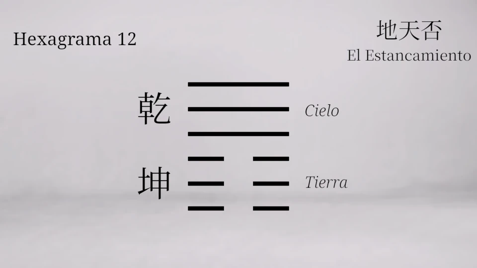
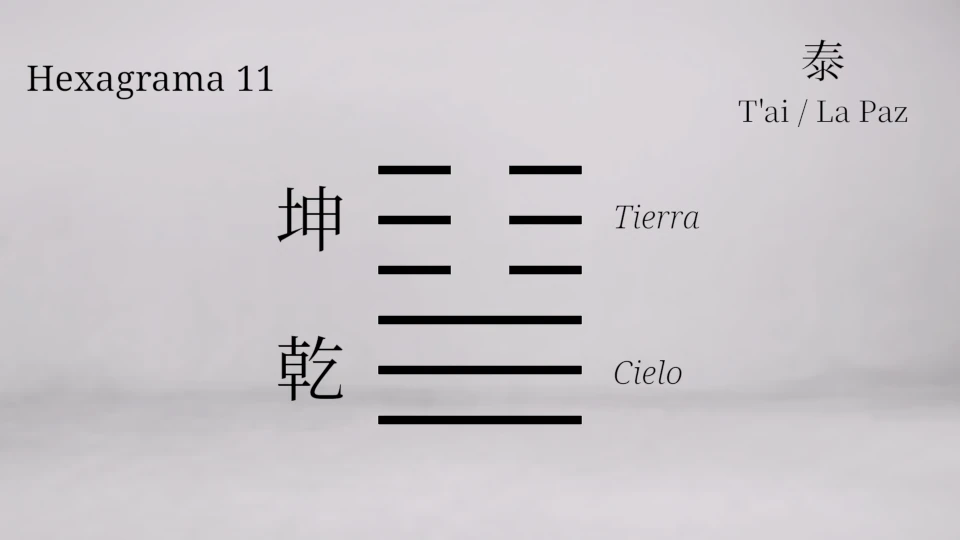

## The Riddle

Of all the principles of Tai Chi, there is one that always struck me as the most mysterious and counterintuitive. It is the first one taught to us by Yang Chengfu:

> 虚领顶劲  
> Xū Lǐng Dǐng Jìn

which means 'Empty, lively, pushing upward, and energetic'.

 was one of the most famous Tai Ji masters.")

We are told to keep the head erect, the spirit at the crown, but without using any muscular tension or force, because force blocks the Chi. In other words, you must have an empty, lively, and natural intention. Without an empty, lively, upward‑pushing, energetic intention, you will not be able to raise your spirit.

And here comes the riddle: How can an intention be empty? If intention is, by definition, an active and full principle that directs us toward a goal… how can it be empty while still being intention?

I found the answer to this in I Ching Hexagram 11, and this discovery changed my Tai Chi practice. Today I want to share with you how [Hexagram 11]({}), Peace, holds the answer and teaches us a true body alchemy.

---

## Internal and External Kung Fu

Many people do not know this, but Tai Ji is a style of Chinese martial art, commonly known as kung fu. People tend to associate kung fu with fast movements that require dexterity and muscular strength. In kung fu, intention is full of effort, direction, and will. However, this is true mostly for external styles of kung fu, such as the brief demonstration of Snake Fist (蛇拳, Shéquán) that I show in the video on my YouTube channel.



Tàijíquán (太极拳) is an internal style of kung fu, and here intention is of a different nature. Xū Lǐng Dǐng Jìn (虚领顶劲) points to the very foundation of Tai Ji: the alignment of body and spirit must be sustained through an empty intention.



If we use force and fill the neck with tension in Tai Ji, it is not correct. But if we simply let go completely, we collapse. So what do we do?

This is where the I Ching comes in, specifically two hexagrams that describe two very different states of being within your own body.

---

## Intention According to the Hexagrams

First, let us look at [Hexagram 12]({}), called P'i, or Stagnation. Its image is Heaven above, Earth below. At first glance, it seems correct: Heaven is supposed to be above and Earth below. So why does this lead to stagnation?

Because Heaven is already high and tends to rise even higher. And Earth is already low and tends to sink even further. So they move apart. They do not communicate. The result is blocked flow and separation; in other words, stagnation. In the body, this means stiffness in the neck and shoulders, a wandering mind in the head, and a heavy body below. It is the state of using force to keep yourself upright.

Now let us look at [Hexagram 11]({}), T'ai, Peace. The image is inverted: Earth above, Heaven below. It seems to be upside down, but the I Ching says this is the condition for true communication. Why? Because Earth is heavy by nature and wants to descend; Heaven is light by nature and wants to ascend. When Earth is placed above, it descends gently; when Heaven is placed below, it ascends. They meet in the middle. They blend, they fertilise each other, and everything flourishes. This is Peace: a dynamic and fertile union, not a mere static absence of conflict.

And this is precisely where Yang Chengfu's first principle becomes a key to internal alchemy.

---

## Internal Alchemy

"Empty, lively, pushing upward, and energetic."

The crown must be empty. That means you place Earth – receptive and still – at the top. You do not push the head upward with the neck muscles. You relax the neck and jaw, creating a subtle receptive space at the crown, like a valley open to the sky.

That empty crown is the Earth above of Hexagram 11.

When you empty the top, the Yang energy, the active principle residing in the lower Dan Tian, begins to rise naturally, without forcing. Just like Heaven from below, it rises lightly, filling the spine, straightening the body without any muscular tension. The spirit awakens, the body becomes weightless and full of life.

That ascending energy is the Heaven below of Hexagram 11.

When you embody Hexagram 11, you stop living in your head. The mind becomes calm yet lucid. The body becomes rooted yet light. The Chi circulates freely. That state is the body alchemy we are talking about.

Now let us consider again the expression "empty intention". Empty intention is the intention of the valley, the intention that does not say "I am going to push the sky upward", but rather "I am going to clear this space so that the sky can fill it." It is an intention that empties itself of force and direction, and in doing so, becomes pure receptivity. It is active because you must maintain it, you must stay attentive, you must not collapse, but it is empty of the usual doing. It is a doing of non‑doing. It is Wu Wei.

That is why the principle says: "without this empty, lively, elevating, and energetic intention, you cannot raise your spirit." If you try to raise the spirit with force, you get Hexagram 12: you tense up, become clumsy and uprooted, and the Qi does not circulate. But if you raise it with an empty intention, you become Hexagram 11: the body roots itself, movement is born from the waist, and the mind becomes serene. The spirit rises without leaving the body, and the body descends without becoming dead weight. They marry.

Hexagram 11 teaches us body alchemy through Tai Ji.

Internal alchemy, Neidan, consists of taking the raw materials of your body and mind – Jing, Chi, Shen – and refining them into a unified and luminous whole. The first step in that process is almost always to invert the habitual pattern. The habitual pattern, the one that society and tension build into us, is Hexagram 12: the mind over‑exerting itself, the body living below its potential. The alchemist's first movement is to reverse that, to put the receptive in charge and let the creative ascend from below, to turn the body into a receptacle for the union of Heaven and Earth.

And Tai Ji, through this single principle, teaches you exactly that inversion from the very first posture. Before any movement, before any form, the simple act of standing with an empty and lively crown is already the cultivation of Peace. It is already the moment when your inner Heaven and Earth meet.

And what is the fruit of that communication? The ancient text says: "Heaven and Earth unite, and all things flourish." In your body, that means health, emotional balance, mental clarity, and a deep, stable peace that does not depend on circumstances. It is the kind of peace in which you can remain even while moving, even while interacting with the world.

---

## Zhàn Zhuāng: Embracing the Tree to Embody Alchemy

The theory of Hexagram 11 comes to life when we bring it into static practice. You do not need to move to experience the union of Heaven and Earth; in fact, stillness is the crucible where this alchemy becomes flesh. That is why, among the fundamental practices of Tai Chi and the internal arts, there is an irreplaceable method: zhàn zhuāng (站桩), or "standing stake". It involves standing still like a tree, integrating the deep rooting and light elevation we have just explored.

One of the best‑known and most accessible postures is chēng bào (撑抱), colloquially called "embracing the tree". To practise it, we begin standing in the Wuji posture (the supreme ultimate), with feet shoulder‑width apart. Exhaling gently, we bend the knees and lower the centre of gravity, adopting a rider's posture – mǎbù (马步) – as if sitting on a horse. The arms rise to form a circle in front of the chest, as if embracing the trunk of an ancient and sturdy tree.

Here is where the principles of Hexagram 11 become precise instructions. First, we completely relax the shoulders and neck: that is Earth above, the crown emptying of tension to become receptive. Breathing is nasal, with the tongue gently resting against the upper palate, thus connecting the governing and conception meridians. The abdomen expands with each inhalation (diaphragmatic breathing), and upon holding and exhaling, we maintain a gentle contraction of the perineum, which helps the energy not to disperse and to rise with integrity.

But the heart of this practice, what turns it into living alchemy, is the visualisation of the energy flow – and here we see Heaven below in action:

On inhalation, visualise the energy entering through the Bǎi Huì point (百會) at the crown – that empty, receptive valley we have created – and descending down the back to Huì Yīn (會陰) at the perineum. From there, it rises and accumulates in the Dan Tien, specifically in Qì Hǎi (氣海), the sea of energy in the lower abdomen. Then, on exhalation, that energy – like Heaven ascending from below – travels through the arms, fills them with life, and extends beyond the palms, flowing through the Láo Gōng points (勞宮). It is as if the tree you embrace returns the energy to you, filtered and purified.



In this moment, the body ceases to be a mere physical support. The crown empties to receive, the Dan Tien fills to nourish, and the palms open to express the union. Heaven and Earth are no longer separate; they meet in your centre, blend and fertilise each other.

With just five minutes daily of this posture, the body begins to remember this alignment organically. The mind quietens, the Chi circulates without obstruction, and the peace of Hexagram 11 ceases to be a philosophical concept and becomes an embodied, stable, and profoundly transformative experience.

---

## Conclusion

The next time you practise, ask yourself in every posture: am I embodying Hexagram 12 or 11?

If you feel tension in the neck, rigid shoulders, a furrowed brow, and a forcing mind, you are in stagnation. But if you empty the crown and relax the neck and shoulders, you will notice a subtle, lively force ascending from below, running up the spine, reaching the highest point, and expressing itself through the tips of your fingers.

In that instant, your body ceases to be something you must control and becomes a living bridge between Heaven and Earth.

That is body alchemy. That is Hexagram 11. And that is the hidden teaching of the first principle of Tai Chi.

---

### Complement the reading with the video:

If you prefer to delve deeper into these concepts visually and listen to the detailed analysis, I invite you to watch the full video on my channel:

